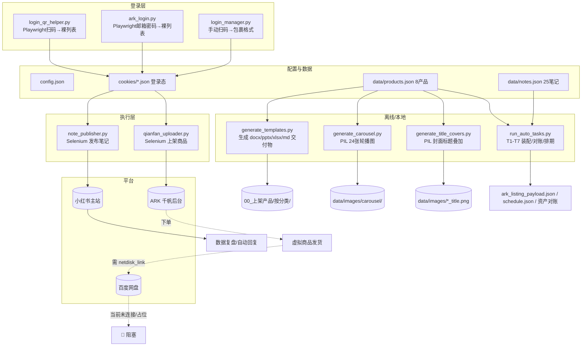

# 小红书虚拟商品一人公司 · 代码与系统诊断报告

> 诊断对象：`xiaohongshu_automation`（自动化引擎，Python）+ `xiaohongshu_shop`（产品与运营资料）
> 诊断人：CodeBuddy Code（资深代码审计 / 系统架构分析）
> 诊断日期：2026-07-16
> 范围：完整代码细读（automation 全部 20 个 .py）+ 运营/产品文档（重点 .md/JSON）+ 合规逐条对照 2026 小红书虚拟商品新规
> 说明：**本报告仅做分析与诊断，未修改任何源文件。**

---

## 结论先行（Executive Summary）

整体看，这套工程已经形成「素材生成 → 数据装配 → 登录 → 上架/发布」的半自动闭环，文档体系完备、任务拆分清晰（T1–T7 + B1–B3），对一人公司是相当成熟的工作流设计。**但代码层面存在若干会直接导致主链路中断的硬性缺陷，且合规风险显著高于项目文档的自我判断。**

最关键的三点：

1. **【P0 崩溃级】Cookie 文件格式在「写入方」与「读取方」之间不兼容。** 当前磁盘上的 `xhs_cookies.json` / `qianfan_cookies.json` 是**裸列表**（`[{name,value,...}]`，由 `login_qr_helper.py` / `ark_login.py` 写入），而 `note_publisher.load_cookies()` 与 `qianfan_uploader.load_cookies()` 却以 `cookies['cookies']` 方式读取（期望 `{"cookies":[...]}` 包裹结构，由 `login_manager.py` 写入）。二者不一致 → `KeyError: 'cookies'`，**笔记发布与商品上架在加载登录态时即崩溃**。而 `check_xhs_cookies.py` 用 `ctx.add_cookies(cookies)` 又能正常吃裸列表，于是出现「自检 VALID 但发布崩溃」的诡异现象。

2. **【P0 依赖缺失】`requirements.txt` 严重不全。** 实际代码 import 了 `python-docx / python-pptx / openpyxl / Pillow / playwright`，但依赖清单只列了 `selenium / webdriver-manager / mcp`。按现有说明全新安装必定 `ImportError`，生成类脚本（4 个）与 QR/ARK 登录脚本（3 个）全部跑不起来。

3. **【P0 合规高危】类目与「2026 小红书虚拟商品新规」存在硬性冲突。** 8 个产品中，**AI提示词包、Notion模板库、小红书笔记模板包**落类不在平台允许的三大虚拟类目内；**毕业答辩PPT**属于「课件/教案/手抄报」类，而新规明确**教育类目改定向邀约、个人店出局**；全量 `netdisk_link` 仍为占位符，所谓「百度网盘自动发货/秒到」**实际并未实现**，与「虚拟商品须即时发货」要求相悖；且全量商品**缺创作证明/授权书**。

次要但明确的缺陷：发布器「找不到发布按钮就默认成功」（`success_count+=1; return True`）会造成**假成功**；`upload_images` 的 JS 兜底分支发送**空文件**；MCP `login` 工具调用了并不存在的 `mgr.login()` 方法；多个脚本把绝对路径、`C:/Windows/Fonts/simhei.ttf` 等写死，跨机/非 Windows 即失效；`ark_listing_payload.json` 仍是「50+套」而 `products.json` 已改「30+套」，**数据包与产品源不一致**。

---

## 一、功能模块清单

### 1.1 automation 目录（核心引擎）

| 模块 | 文件 | 职责 | 入口/可被谁调用 | 对外依赖 |
|---|---|---|---|---|
| 主入口/调度 | `xhs_auto_main.py` | 统一编排：登录、批量上架、批量发布、完整流水线、状态报告 | CLI（`--login/--upload-products/--publish-notes/--full/--status`）；被 MCP 间接引用 | Selenium 驱动 |
| MCP 服务 | `xhs_auto_mcp.py` | 把自动化能力封装为 FastMCP stdio 工具（check_status/login/publish_note/upload_product/batch_*） | MCP Server（`python xhs_auto_mcp.py`） | mcp、selenium、login_manager/note_publisher/qianfan_uploader |
| 登录管理 | `login_manager.py` | 手动扫码登录小红书/千帆，`input()` 阻塞；写入 `{"cookies":[...]}` 包裹格式 | CLI / 被 xhs_auto_main 调用 | Selenium |
| 二维码登录助手 | `login_qr_helper.py` | 无头 Playwright 截二维码 + 轮询登录态，写**裸列表** cookies | CLI（`xhs`/`qianfan`） | **Playwright（未在 requirements）** |
| ARK 邮箱登录 | `ark_login.py` | 无头 Playwright 邮箱+密码登录千帆，写**裸列表** cookies | CLI（`--email --password`） | **Playwright（未在 requirements）** |
| 笔记发布器 | `note_publisher.py` | 用 Selenium 填标题/正文/图/标签并发布；读取包裹格式 cookies | CLI / 被 main、MCP 调用 | Selenium |
| 千帆上架器 | `qianfan_uploader.py` | 用 Selenium 填商品标题/价格/库存/描述/图并提交；读取包裹格式 cookies | CLI / 被 main、MCP 调用 | Selenium |
| 数据加载 | `data_loader.py` | 解析 Markdown 格式的笔记/商品内容 → 结构化 dict | 被 xhs_auto_main 引用（`.md` 分支） | 无（纯正则） |
| 一键任务编排 | `run_auto_tasks.py` | T1 清目录 / T2 回填 template_file / T3 配图+话题 / T6 生成 ARK 数据包 / T7 排期 / T4 资产对账 | CLI 直接运行 | 仅本地文件 |
| 素材修复A | `fix_materials.py` | 答辩PPT 50+→30+ 三处同步；10 条种草文案重写；排期修正 | CLI | 仅本地文件 |
| 素材修复B | `fix_notes_schedule.py` | 用子类目作 key 重做笔记配图映射 + 重排期（与 run_auto_tasks T3/T7 逻辑重复） | CLI | 仅本地文件 |
| 封面文字叠加 | `generate_title_covers.py` | 用 PIL 给 8 张封面叠加 ≤9 字标题，回写 products/notes 首图 | CLI | **Pillow（未在 requirements）**、`C:/Windows/Fonts/simhei.ttf` |
| 轮播图生成 | `generate_carousel.py` | 用 PIL 为 8 产品各生成 痛点/卖点/引导 3 张信息图（共 24 张），挂载 notes | CLI | **Pillow（未在 requirements）**、`C:/Windows/Fonts/simhei.ttf` |
| 模板生成 | `generate_templates.py` | 真实生成 8 套可编辑交付物（docx/pptx/xlsx/md） | CLI | **python-docx / python-pptx / openpyxl（均未在 requirements）**、`Microsoft YaHei` |
| cookies 校验 | `check_xhs_cookies.py` | 用 Playwright 校验 xhs 主站 cookie 有效性（检测是否跳 /login） | CLI | **Playwright（未在 requirements）** |
| IMA 归集 | `build_ima_bundle.py` | 把运营文档/产品数据/工作记忆/技能/模板归集到 `IMA上传汇总/` 并生成上传清单 | CLI | 仅本地文件、含多处硬编码路径 |
| 配置 | `config/config.json` | 全局参数（登录超时、无头开关、限流 delay、retry、路径） | 各模块读取 | — |
| 数据 | `data/products.json`、`data/notes.json` | 8 个产品、25 条笔记的权威数据 | 各模块读写 | — |
| 凭证 | `cookies/*.json` | 登录态（当前为裸列表） | 加载方读取 | 明文落盘 |

### 1.2 shop 目录（产品与运营资料）

| 模块 | 文件 | 职责 |
|---|---|---|
| 运营策略 | `知识库_2026最新运营策略.md` | 选品/定价/内容节奏/转化路径/合规红线 |
| 启动计划 | `快速启动执行计划.md` | 启动前置、执行顺序、频率安全 |
| 任务总览 | `剩余任务总览.md` | 已完成 12 项 + 阻塞项 B1/B2/B3 + 资产盘点 |
| 任务清单 | `下一阶段自动任务清单.md` | T1–T7 全自动任务设计 + 人工前置 B1–B3 |
| 上架汇总 | `00_上架产品/00_产品上架汇总.md` | 8 产品总表、上架要点、必填、命令 |
| 分类总览 | `00_上架产品/分类总览.md` | 5 一级类目 / 产品→类目映射 / 标签体系 |
| ARK 数据包 | `00_上架产品/ark_listing_payload.json` | 8 产品上架结构化数据（含类目映射/交付/网盘占位） |
| 资产对账 | `00_上架产品/资产对账报告.md` | 产品↔文件↔封面↔IMA 一致性 + 缺口 |
| 网盘对接 | `00_上架产品/网盘对接操作清单.md` | 连接 baidu-netdisk 后的 4 步自动流程 |
| 笔记集 | `01_小红书笔记/商品笔记集.md`、`02_引流笔记集.md`、`素材清单.md`、`轮播图素材清单.md` | 笔记内容/素材核验 |
| 排期 | `01_小红书笔记/发布排期.md`、`schedule.json` | 25 条发布时间轴 |
| IMA 汇总 | `IMA上传汇总/`（产品数据/产品模板/工作记忆/技能SKILL/运营文档 + 上传清单.md） | 供手动上传 IMA 知识库的归集包 |

---

## 二、技术架构与数据流

### 2.1 主链路（配置 → 登录 → 素材生成 → 笔记发布 → 商品上架 → 订单/发货）

### 2.2 数据流转说明

- **产品主数据**：`products.json`（title/price/images/category/subcategory/dir/netdisk_link/template_file）→ `generate_templates.py` 据 `dir` 生成真实模板文件落到 `00_上架产品/按分类/`；`run_auto_tasks.py T6` 据其拼装 `ark_listing_payload.json`；`generate_title_covers.py` 据 `images[0]` 叠加标题并回写 `products.json`。
- **笔记主数据**：`notes.json`（title/content/tags/images/topics/_match_sub）→ `run_auto_tasks.py T3` 与 `fix_notes_schedule.py` 做配图映射与排期分类 → `generate_carousel.py` 挂载轮播图 → `schedule.json` 供发布脚本消费。
- **登录态**：登录脚本写 `cookies/*.json`，发布/上架脚本读取并 `add_cookie` 后操作平台。**这是当前最脆弱的一环（见问题 #1/#2）。**
- **交付闭环**：ARK 上架 → 用户下单 → 平台应「即时发货」网盘链接，但 `netdisk_link` 全量为占位符、网盘未连接、代码无任何自动发货实现，闭环在「发货」处断开。

---

## 三、问题列表

| 编号 | 文件 | 问题描述 | 严重度 |
|---|---|---|---|
| P-01 | `note_publisher.py` `load_cookies` / `qianfan_uploader.py` `load_cookies` | **Cookie 格式不兼容崩溃**：磁盘 cookies 是裸列表，读取方用 `cookies_data['cookies']`，抛 `KeyError: 'cookies'`，发布/上架在加载登录态时即失败。当前 `xhs_cookies.json`/`qianfan_cookies.json` 均为裸列表（由 `login_qr_helper.py`/`ark_login.py` 写入），与读取方契约不一致。 | 高 |
| P-02 | `requirements.txt` | **依赖清单严重缺失**：代码实际 import `python-docx`、`python-pptx`、`openpyxl`、`Pillow`、`playwright`，但清单只列 `selenium/webdriver-manager/mcp`。全新安装后 4 个生成脚本 + 3 个登录/校验脚本全部 `ImportError`。README 注释甚至错误声称「当前代码仅用 Selenium，未直接 import playwright」。 | 高 |
| P-03 | `note_publisher.py:505-507` | **假成功**：发布流程若找不到「发布」按钮，仍 `self.success_count += 1; return True`，把失败上报为成功，导致对账/统计失真、且可能漏发未察觉。 | 高 |
| P-04 | `note_publisher.py:251-274` | **JS 兜底上传发送空文件**：图片上传控件缺失时走 JS 分支，构造 `new File([''], name)`（空内容）并 dispatch change，不会真正上传真实图片，且静默「成功」。 | 中 |
| P-05 | `xhs_auto_mcp.py:66` | **MCP login 工具调用不存在的方法**：`mgr.login(platform)` 而 `XHSLoginManager` 只有 `login_xiaohongshu`/`login_qianfan`，会 `AttributeError` 被吞为 error，MCP 登录不可用。 | 中 |
| P-06 | `ark_listing_payload.json` vs `products.json` | **数据包与产品源不一致**：ARK 数据包中「毕业答辩PPT模板包」仍为「50+套」，而 `products.json` 经 `fix_materials.py` 已改为「30+套」；说明 T6 生成后未随产品修正重跑，存在上架数据陈旧风险。 | 中 |
| P-07 | 全局（多脚本） | **硬编码绝对路径**：`run_auto_tasks.py`/`fix_*.py`/`verify_materials.py`/`build_ima_bundle.py` 写死 `E:/AgentCPM/04_开发脚本_工具`；`build_ima_bundle.py` 还写死 `e:/AgentCPM/07_一人公司出海项目/.workbuddy/memory`、`C:/Users/lixingliang/...` 等机器专属路径；`generate_*.py` 写死 `C:/Windows/Fonts/simhei.ttf` 与 `Microsoft YaHei`。跨机/非 Windows 即失效，不可移植。 | 中 |
| P-08 | `generate_templates.py` | **字体/库缺容错**：依赖 `Microsoft YaHei` 与 Windows 字体路径，未做异常兜底；缺失依赖时直接抛错。 | 中 |
| P-09 | `xhs_auto_main.py` 配置 `upload.retry_attempts` | **重试/熔断形同虚设**：`config.json` 有 `retry_attempts:3`，但 `upload_products`/`publish_notes` 实际只用 `time.sleep` 固定间隔，无真正重试循环、无失败退避/熔断；单条失败后仅计数跳过。 | 中 |
| P-10 | `login_manager.py` `validate_cookies` | **Cookie 校验无效**：仅检查文件是否存在 + 是否为空，不解析 `expires`、不访问平台，无法判断真实过期；`xhs_auto_mcp.check_status` 同理只看文件存在即报「已登录」。 | 中 |
| P-11 | `login_manager.py` `login_xiaohongshu/login_qianfan` | **登录态无自动刷新**：依赖人工 `input()` 扫码，过期后必须人工介入；无定时刷新/临近过期预警。 | 中 |
| P-12 | `ark_login.py:45-48` | **凭证以命令行参数明文传递**：`--email/--password` 会出现在 shell 历史与进程列表（ps），泄露风险。 | 中 |
| P-13 | `login_qr_helper.py` / `ark_login.py` | **人机验证无助**：触发滑块/点选验证码时脚本直接失败，需人工在浏览器登一次再导 cookie，文档已承认但未在代码中兜底或告警重试。 | 低 |
| P-14 | `run_auto_tasks.py` / `fix_notes_schedule.py` | **重复/冲突逻辑**：T3/T7 的笔记配图与排期逻辑在 `run_auto_tasks.py` 与 `fix_notes_schedule.py` 各实现一份，判定阈值/默认兜底不同（前者默认兜底 key 列表首个，后者兜底首个子类目），易产生不一致。 | 低 |
| P-15 | `note_publisher.py` / `qianfan_uploader.py` | **选择器脆弱**：大量 `//button[contains(text(),'发布')]`、`[data-testid=...]` 等硬编码/猜测式选择器，未适配 XHS UI 变动；README 也标注「登录后需验证选择器适配」（任务 50 未完成）。 | 低 |
| P-16 | `note_publisher.py:389-425` 等 | **异常被静默吞掉**：`wait_and_click`/`add_tags` 等大量 `except: return None/True`，定位问题困难，无法区分「元素未找到」与「真的成功」。 | 低 |
| P-17 | `note_publisher.publish_batch` | **限流参数未联动**：`main` 中笔记间隔 `time.sleep(60)`，但 `config.upload.max_per_hour=10`；`publish_batch` 用 `random.randint(60,120)` 随机间隔，与 README「每小时≤10 篇」的硬性上限无强制约束，存在被限流风险。 | 低 |
| P-18 | `check_xhs_cookies.py` | **与 load_cookies 格式契约相反**：用 `ctx.add_cookies(cookies)`（吃裸列表），与其余读取方契约相反——这是 P-01 的镜像面，进一步证明 cookie 格式全项目不统一。 | 高（根因） |

---

## 四、缺失环节（相对「发布→生成→上架审核→日常运营」全流程）

对照「内容生成 → 审核上架 → 发布 → 订单/发货 → 复盘运营」理想闭环，当前覆盖度如下：

| 环节 | 覆盖情况 | 说明 |
|---|---|---|
| 内容/素材生成 | ✅ 较完整 | 模板、封面、轮播、笔记文案均有脚本；但标题叠加(T-G)为后补，轮播图为占位待优化 |
| 上架数据装配 | ✅ 完整 | products/notes/ark payload/schedule 齐备 |
| 登录态获取 | ⚠️ 半自动 | 有 QR/邮箱脚本，但需人工扫码/凭证；无自动刷新 |
| 商品上架（ARK 审核前填表） | ⚠️ 仅骨架 | `qianfan_uploader` 用脆弱选择器填表提交，**未实现类目树选择、属性/SKU、创作证明上传、收款绑定校验**，且 cookie 读取崩溃（P-01） |
| 类目/资质审核 | ❌ 缺失 | 无任何代码处理「创作证明/授权书上传」「教育类目定向邀约」等审核前置；纯靠人工在后台做 |
| 笔记发布 | ⚠️ 仅骨架 | 同上脆弱选择器 + 假成功(P-03) + 空文件(P-04) |
| 订单/自动发货 | ❌ 缺失（最严重业务断点） | `netdisk_link` 全量占位、网盘未连接、代码无任何自动发货/网盘分享链接回填逻辑；「秒到/即时发货」仅为文案承诺，**未落地** |
| 客服/自动回复 | ❌ 缺失 | 运营策略要求「关键词自动回复引导私信」，但无实现（仅策略文档描述） |
| 数据复盘/熔断 | ⚠️ 仅文档 | 策略有周复盘，但无代码采集曝光/互动/成交指标，无异常熔断 |
| 监控/告警 | ❌ 缺失 | 无日志聚合、无失败告警（config 有 notification 但 `enabled:false` 且无实现） |

**结论**：工程覆盖了「上游生成 + 数据装配」，但在最关键的**「上架审核前置」「真实自动发货」「发布可靠性」「监控告警」**四段要么仅占位、要么缺失。一人公司最该自动化的「发货/客服/复盘」恰恰是空白。

---

## 五、风险评估

### 5.1 稳定性风险

- **登录态是单点脆弱源**：cookies 裸列表 vs 包裹格式不统一（P-01/P-18）→ 发布/上架直接崩溃；且无自动刷新（P-11）、校验无效（P-10）。一旦过期，全链路人工阻塞。
- **无重试/熔断（P-09）**：单条失败仅跳过，无退避、无熔断，批量任务中途异常可能留下半成品。
- **平台反爬/封号风险高**：Selenium + 固定 UA + 已知选择器，小红书对自动化发布识别严格；`headless:false` 默认手动，但批量发布仍属违规自动化，存在限流/封号（尤其个人店）。
- **假成功掩盖故障（P-03）**：统计面板「成功」可能含实际失败，导致误判运营健康度。
- **选择器脆弱（P-15）**：XHS UI 改版即大面积失效，无兜底，且 README 已标注任务 50（选择器适配）**尚未完成**。
- **依赖/环境不可复现（P-02/P-07）**：缺依赖清单 + 硬编码路径/字体，换机或他人接手几乎必然跑不通。

### 5.2 合规风险（逐项对照 2026 小红书虚拟商品新规）

> 新规要点：虚拟类目三大类 = PPT/简历/其他模板、课件/教案/手抄报、头像壁纸；个人店新门槛 = 入驻满180天+30笔记+1000粉+无违规+证明；教育类目改定向邀约、个人店出局；商品须创作证明/授权书；虚拟商品须「即时发货」；标题禁「免费送/全网最全」等极限词；图片禁二维码/微信号。

| 新规条款 | 当前项目表现 | 判定 | 建议 |
|---|---|---|---|
| 虚拟类目三大类 | 8 产品中：PPT 类(3)/简历(1)/Excel看板(1) 可归入「PPT/简历/其他模板」；但 **AI提示词包**（类目 `AI工具/效率助手`）、**Notion模板库**（类目 `效率工具/系统模板`）、**小红书笔记模板包**（类目 `自媒体运营/模板`）**均不在三大允许类目内**；`ark_listing_payload` 自定义类目树（`AI工具/效率助手`等）与平台真实类目树不一致 | **风险** | 将 AI提示词包/Notion/笔记模板重新归到「其他模板」桶；AI提示词包是否属虚拟商品类目需先向平台确认，存在被拒类目风险 |
| 教育类目定向邀约/个人店出局 | **毕业答辩PPT**（属「课件/教案/手抄报」方向）面向毕业生，按新规教育类目已转定向邀约且个人店不可经营 | **风险（高）** | 个人店切勿上架答辩/课件类；若坚持，须升级为企业店并走定向邀约资质，否则上架即违规/下架 |
| 个人店新门槛（180天/30笔记/1000粉/无违规/证明） | 项目文档未提供店铺资质证据；自动化仅处理发布，不校验门槛 | **风险** | 上架前先确认店铺已满足门槛；未满足时发布笔记/商品可能被限流或下架 |
| 商品须创作证明/授权书 | 8 个产品**均无**创作证明/授权书字段或附件（模板为脚本生成，但无人主张权属/授权） | **风险** | 为每个产品补充原创创作证明（生成记录/源文件时间戳）或素材授权书，ARK 上架通常必填 |
| 虚拟商品须「即时发货」 | 描述写「百度网盘自动发货/下单后秒到」，但 `netdisk_link` 全量为 `【待填写】`、网盘未连接、**代码无任何自动发货实现** | **风险（高）** | 先打通网盘链接回填与自动发货（B2/B3），否则既违反「即时发货」要求，又会造成买家下单后收不到货的客诉/纠纷 |
| 标题禁极限词（免费送/全网最全等） | 扫描 8 标题 + 25 笔记：未出现「免费送/全网最全/第一/顶级/国家级/唯一」等；有「110+条/1200+套/永久更新/一份顶一年」——「永久」属较强承诺，但未落入明文禁词 | **基本合规** | 把「永久更新」改为「持续更新」等 softer 表述，避免绝对化承诺纠纷 |
| 图片禁二维码/微信号 | 轮播图引导文案含「私信【提示词】立即领取」「评论区扣1，拉你进交流群」等站外引流话术（非二维码/微信号本身，但属引流引导）；二进制封面图无法静态核验是否含二维码 | **需核验** | 复核所有图片（尤其 guide 图）确保无二维码/微信号/外链；引流话术改为平台内允许的「主页/收藏」引导，降低站外导流违规 |
| 内容原创/不搬运 | 模板为脚本自生成，笔记为原创文案 | **合规** | 保持；注意 AI提示词包若含第三方提示词汇编，需确认无抄袭 |
| 不支持退款规则明示 | 运营策略提及「虚拟商品需明确不支持退款」，但商品描述中未写入该说明 | **风险（低）** | 在 description 中补充「虚拟商品一经发货不支持退款」等平台允许范围内的售后说明 |

**合规总判定**：当前最危险的是 **(a) 个人店上架教育类(答辩PPT) 违规、(b) 三个产品类目不在允许范围、(c) 缺创作证明、(d) 即时发货未实现**。这四项任一被平台核查即可能导致商品下架、店铺处罚。项目文档（如 `知识库_2026最新运营策略.md`）虽列了合规红线，但**代码与上架数据并未落实**，且对「教育类目个人店出局」「类目落桶」两条认知不足。

### 5.3 安全风险

- **凭证明文落盘**：`cookies/*.json` 含完整会话 cookie（含 `web_session`、`a1` 等敏感值），以明文 JSON 存于本地。`.gitignore` 已忽略 `cookies/`，**未进版本库**（这是做对的地方），但磁盘上无加密、无权限控制，机器被他人访问即被盗用。
- **密码走命令行参数（P-12）**：`ark_login.py --password` 明文进 shell 历史/进程列表，建议改读环境变量或交互输入（且不回显）。
- **版本库覆盖**：`.gitignore` 已覆盖 `cookies/`、`logs/`、`__pycache__/`、`data/images/`，配置 `config.json` 不含密钥、无需忽略；未发现密钥入库。安全基线尚可，但缺 `.env` 机制与密钥管理规范。
- **自动化即违规操作**：Selenium 自动化发布/上架本身违反小红书用户协议对「自动化工具」的禁止性条款，账号有被封风险——这属于业务合规而非代码安全，但需在风险登记中标注。

---

## 六、总体结论与优先级建议

### 6.1 总体结论

工程**架构设计合理、文档与任务拆分专业**，但**代码实现与合规落地存在硬伤**：主链路因 cookie 格式不统一会直接崩溃（P-01），依赖清单不全导致不可复现（P-02），发布可靠性差（P-03/P-04），而最关键的「自动发货/资质审核/监控」环节缺失。合规侧对 2026 新规的**类目落桶、教育类目、创作证明、即时发货**四条存在高风险误判。建议**先止血（P0），再补闭环（P1），最后做健壮性（P2）**，且在未解决合规 P0 前，**不要**将答辩PPT等高风险商品上架。

### 6.2 优先级建议

**P0（必须立即修复，否则主链路不通 / 违规）**
1. 统一 cookie 格式：让所有写入方（login_manager/qr/ark）与读取方（note_publisher/qianfan_uploader/check）共用同一结构（推荐统一为裸列表，读取方改为兼容两种格式并解析 `expires`）。修复 P-01/P-18。
2. 补全 `requirements.txt`：`selenium`、`webdriver-manager`、`mcp`、`playwright`、`Pillow`、`python-docx`、`python-pptx`、`openpyxl`。修复 P-02。
3. 修复发布「假成功」：找不到发布按钮应判失败并截图，而非 `return True`。修复 P-03。
4. 合规前置：下架/暂缓「毕业答辩PPT」等教育类目（个人店出局）；将 AI提示词包/Notion/笔记模板 归到「其他模板」并确认类目可售；补齐创作证明；**在上架前打通网盘链接与即时发货**，否则不标「秒到」。

**P1（应在首单上架前完成）**
5. 修复 MCP `login` 调用（P-05）。
6. 重跑 T6 使 `ark_listing_payload.json` 与 `products.json` 一致（P-06，答辩 30+套）。
7. 去除硬编码绝对路径与 Windows 字体路径，改为配置/相对路径（P-07/P-08）。
8. 实现真正的重试/退避/熔断，并接入 `notification`（P-09）；Cookie 临近过期预警（P-10/P-11）。
9. 重写脆弱选择器并适配当前 XHS UI（任务 50）；异常不再静默吞掉（P-15/P-16）。

**P2（健壮性与长期运营）**
10. 实现订单自动发货 / 网盘链接回填 / 关键词自动回复（补齐缺失环节）。
11. 建立数据复盘采集与失败告警监控。
12. 统一重复的 T3/T7 逻辑，抽公共模块（P-14）。
13. `ark_login` 凭证改环境变量/交互输入（P-12）；cookie 文件加本地权限约束或加密。
14. 限流参数与发布间隔强制联动，避免触发平台风控（P-17）。

---

*（本报告基于 2026-07-16 对两目录全量源码与文档的静态审阅，未执行任何脚本、未改动任何文件。）*
