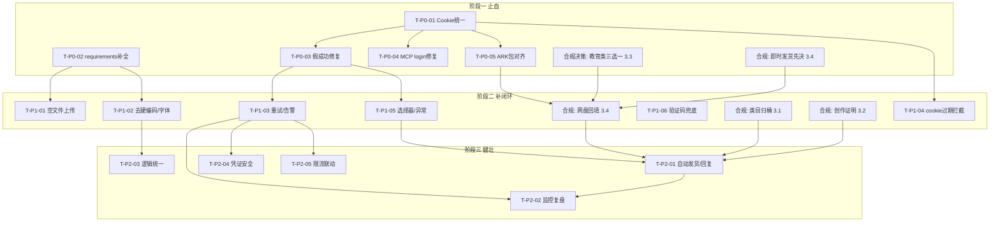

# 小红书虚拟商品一人公司 · 代码与系统改进方案（第 2 步）

> 对象：`xiaohongshu_automation`（自动化引擎）+ `xiaohongshu_shop`（产品/运营）
> 上游诊断：`opc-doc/outputs/00-diagnosis/diagnosis-report.md`
> 制定人：CodeBuddy Code（代码与合规改进规划）
> 日期：2026-07-16
> **说明：本文档仅给出改进方案与改动点，不修改任何源文件。**

---

## 结论先行（Executive Summary）

诊断报告已定位 18 项代码问题（P-01~P-18）+ 4 段缺失业务环节 + 4 项高危合规风险。本方案将其转化为 **15 个可执行任务**，按 **P0 止血（5 项）→ P1 补闭环（6 项）→ P2 健壮性（4 项）** 推进。

**最优先（P0，不修主链路直接崩 / 违规）**：
1. Cookie 格式不统一（裸列表 vs `{'cookies':[...]}`，P-01/P-18）—— 统一为 `{'cookies':[...]}`，改写入端（`login_qr_helper.py`/`ark_login.py`）、读取端（`note_publisher.py`/`qianfan_uploader.py`）、自检端（`check_xhs_cookies.py`），消除「自检 VALID 但发布崩溃」。
2. `requirements.txt` 缺 5 个真实依赖（P-02）—— 补齐 `playwright/Pillow/python-docx/python-pptx/openpyxl`。
3. `note_publisher` 假成功（P-03）—— 找不到发布按钮仍 `success_count+=1` 必须改为失败+重试/告警。
4. MCP `login` 调用不存在的 `mgr.login()`（P-05）—— 改为 `login_xiaohongshu/login_qianfan`。
5. `ark_listing_payload.json` 仍是「50+套」而 `products.json` 已改「30+套」（P-06）—— 重跑 T6 对齐。

**合规高压线（P0 范畴，单列第 3 节）**：在账号资质未知时按「个人店最严假设」处理 —— **毕业答辩 PPT（教育类）默认高危**，给出「下架 / 换类目 / 补资质」三选一；AI提示词包 / Notion 模板库 / 小红书笔记模板包 三类不在平台允许的三大虚拟类目内，须归桶；8 个商品全量缺创作证明/授权书、全量 `netdisk_link` 占位（即时发货未落地）。

**依赖关系**：P0 全部为 P1/P2 的前置（尤其 cookie 统一是发布/上架一切动作的地基）；合规整改须在上架前完成。

---

## 一、任务化改进清单

> 说明：每个任务含「任务名 / 对应问题编号 / 文件·函数级改动点（函数名 + 改动思路与伪代码）/ 验收标准」。
> 排序严格 P0（止血）→ P1（补闭环）→ P2（健壮性）。

### 1.1 P0 — 止血（主链路不通 / 违规，必须最先做）

#### T-P0-01 统一 Cookie 格式（裸列表 ↔ `{'cookies':[...]}` 双向兼容）
- **对应问题**：P-01、P-18（根因）
- **改动点**
  - **写入端 ①** `login_qr_helper.py` → `main()`（约 L217-219）：当前 `ck_path.write_text(json.dumps(cookies, ...))` 写裸列表。改为统一包裹：
    ```python
    cookies = ctx.cookies()
    ck_path.write_text(json.dumps({
        "cookies": cookies,
        "timestamp": datetime.now().isoformat(),
        "url": prot_url
    }, ensure_ascii=False, indent=2), encoding="utf-8")
    ```
  - **写入端 ②** `ark_login.py` → `main()`（约 L97-101）：同样由 `json.dumps(cookies, ...)` 改为 `{"cookies": cookies, "timestamp": ..., "url": LOGIN_URL}` 包裹。
  - **读取端 ①** `note_publisher.py` → `NotePublisher.load_cookies()`（L102-118）：将 `for cookie in cookies_data['cookies']:` 改为兼容两种格式：
    ```python
    raw = json.load(f)
    cookies = raw['cookies'] if isinstance(raw, dict) and 'cookies' in raw else raw
    # 过滤缺少 name 的非法项
    cookies = [c for c in cookies if isinstance(c, dict) and c.get('name')]
    ```
  - **读取端 ②** `qianfan_uploader.py` → `QianfanUploader.load_cookies()`（L104-116）：同上改写 `cookies_data['cookies']` 读取。
  - **自检端** `check_xhs_cookies.py`（L19 `json.load` + L28 `ctx.add_cookies(cookies)`）：同样标准化解析，使其与读取端契约一致（这是「自检 VALID 但发布崩溃」的镜像面）。
  - **（推荐）抽公共工具**：新增 `cookie_utils.py` 提供 `normalize_cookies(raw) -> list` 与 `save_cookies(path, cookies, url)`，三处写入/读取统一调用，避免再次漂移。
- **建议的统一规范**：磁盘 cookie 一律为 `{"cookies":[...], "timestamp":"...", "url":"..."}`；读取方无条件兼容「裸列表」旧文件（一次性向前兼容，避免已有裸列表 cookie 失效）。
- **验收标准**：
  1. 用 `login_qr_helper.py` 重新登录（产出包裹格式）后，`note_publisher` / `qianfan_uploader` 加载不再抛 `KeyError: 'cookies'`；
  2. 旧的裸列表 cookie 文件仍能被读取（兼容分支生效）；
  3. `check_xhs_cookies.py` 与 `load_cookies` 对**同一文件**判定有效性一致（不再出现「自检 VALID 发布崩溃」）；
  4. 端到端：`--login`（QR）→ `--publish-notes` 链路贯通。

#### T-P0-02 补全 `requirements.txt` 真实依赖
- **对应问题**：P-02
- **改动点** `requirements.txt`（L7-12）：删除错误注释（L11-12「当前代码仅用 Selenium，未直接 import playwright」），补齐实际 import 项：
  ```text
  selenium>=4.15.0
  webdriver-manager>=4.0.0
  mcp>=1.0.0
  playwright>=1.40.0
  Pillow>=10.0.0
  python-docx>=1.1.0
  python-pptx>=0.6.23
  openpyxl>=3.1.0
  ```
  （另：用 Playwright 的项目需 `playwright install chromium` 作为环境步骤写入 README。）
- **验收标准**：新建干净 venv，`pip install -r requirements.txt` 后执行
  `python -c "import playwright, PIL, docx, pptx, openpyxl, selenium, mcp"` 全部成功；4 个生成脚本 + 3 个登录/校验脚本可 import 运行。

#### T-P0-03 修复 `note_publisher` 假成功
- **对应问题**：P-03
- **改动点** `note_publisher.py` → `NotePublisher.publish_note()`（L504-507）：当前找不到发布按钮仍 `self.success_count += 1; return True`。改为判失败 + 截图 + 触发重试/告警：
  ```python
  # 所有 publish_selectors 均未命中
  self.take_screenshot("publish_button_not_found")
  print("[!] 未找到发布按钮，判定为发布失败")
  self.failed_count += 1
  return False          # 不再假装成功
  ```
  增强：在点击发布按钮后，将「成功提示」检测从「可选」改为「必须」——仅当命中 `发布成功/已发布` 才 `success_count += 1`，否则判失败（L483-501 段加 `else: 失败处理`）。`publish_batch` 拿到 `False` 后由调用方决定是否重试/告警（配合 T-P1-03）。
- **验收标准**：构造「发布按钮缺失」场景，`failed_count += 1`、`success_count` 不变、`publish_note` 返回 `False`、生成 `publish_button_not_found_*.png`；批量结果 `results` 中该条 `success=False`，可被上层重试/告警逻辑识别。

#### T-P0-04 修复 MCP `login` 调用不存在的 `mgr.login()`
- **对应问题**：P-05
- **改动点** `xhs_auto_mcp.py` → `login()`（L64-67）：`XHSLoginManager` 只有 `login_xiaohongshu` / `login_qianfan`，无 `login`。改为按 platform 分发：
  ```python
  mgr = XHSLoginManager(_load_config())
  out = {}
  if platform in ("xhs", "both"):
      out["xhs"] = mgr.login_xiaohongshu()
  if platform in ("qianfan", "both"):
      out["qianfan"] = mgr.login_qianfan()
  return {"success": True, "data": out}
  ```
- **验收标准**：MCP 调用 `login("xhs")` / `login("both")` 触发真实登录方法，无 `AttributeError`；返回结构含 `xhs`/`qianfan` 子结果。

#### T-P0-05 `ark_listing_payload.json` 与 `products.json` 数据对齐
- **对应问题**：P-06
- **改动点**
  - 根因：T6（`run_auto_tasks.py`）生成 ARK 数据包后，未随 `fix_materials.py` 把「50+套」改为「30+套」重跑，导致 `ark_listing_payload.json` L18 仍为「50+套」，而 `products.json` L25 已为「30+套」。
  - **正确做法（单一数据源）**：以 `products.json` 为权威源，重跑 `run_auto_tasks.py` 的 T6 重新生成 `ark_listing_payload.json`，不要手工改 JSON。
  - **临时兜底**：若暂不重跑，至少将 `ark_listing_payload.json` L18 `"毕业答辩PPT模板包 | 50+套..."` 改为 `"30+套"`，并同步 description 中的「50+套」。
  - **加校验**：新增 `verify_materials.py`（或 `run_auto_tasks` 末尾）做一致性断言——8 个商品的 title/price/数量词 与 `products.json` 逐一比对，不一致则报错退出。
- **验收标准**：`ark_listing_payload.json` 中毕业答辩 PPT 显示「30+套」；一致性脚本确认 8 商品 title/price/数量词 与 `products.json` 全匹配，无差异。

---

### 1.2 P1 — 补闭环（首单上架前完成）

#### T-P1-01 修复空文件 JS 兜底上传
- **对应问题**：P-04
- **改动点** `note_publisher.py` → `upload_images()`（L249-274）：当无真实 `file` input 时，JS 分支构造 `new File([''], name)`（空内容）并 `dispatch change`，且 `return True` 静默「成功」。改为：
  ```python
  if not upload_input:
      self.take_screenshot("image_input_not_found")
      print("[!] 未找到图片上传控件，图片上传失败")
      return False      # 不再假装成功、不再发空文件
  ```
  （保留下方真实 `send_keys` 普通上传路径即可；如确需 JS 兜底，须读取真实文件二进制并用 `File([bytes], name)` 构造，禁止空内容。）
- **验收标准**：图片控件缺失时 `upload_images` 返回 `False` → `publish_note` 在 L443 处中止并记失败；无空文件被 `dispatch` 到页面。

#### T-P1-02 去除硬编码绝对路径 + 字体容错
- **对应问题**：P-07、P-08
- **改动点**
  - `check_xhs_cookies.py` L5-6：把 `COOKIES = r"E:/AgentCPM/.../xhs_cookies.json"` 改为 `COOKIES = Path(__file__).resolve().parent / "cookies" / "xhs_cookies.json"`；`OUT` 同理相对到 `xiaohongshu_shop/00_上架产品/`（或改为读 config）。
  - `run_auto_tasks.py` / `fix_materials.py` / `fix_notes_schedule.py` / `verify_materials.py` / `build_ima_bundle.py`：所有 `E:/AgentCPM/04_开发脚本_工具`、`e:/AgentCPM/07_一人公司出海项目/.workbuddy/memory`、`C:/Users/lixingliang/...` 等写死路径 → 用 `BASE = Path(__file__).parent` + 经 `config.json` 的 `paths` 解析。
  - `generate_title_covers.py` / `generate_carousel.py`：`C:/Windows/Fonts/simhei.ttf` 与 `'Microsoft YaHei'` → 抽 `resolve_font()`：依次尝试配置字体路径、常见系统字体、PIL 默认；缺失时降级而非崩溃（P-08）。
- **验收标准**：在任意 CWD（含非 `E:/AgentCPM` 目录）下运行上述脚本不出现 `FileNotFoundError`；缺字体时打印告警并降级继续，不抛未捕获异常。

#### T-P1-03 实现真正重试 / 退避 / 熔断 + 告警接入
- **对应问题**：P-09
- **改动点**
  - `note_publisher.publish_batch()`（L515-545）、`qianfan_uploader.upload_batch()`（L399-429）：当前仅 `time.sleep` 固定间隔、单条失败仅计数跳过。新增重试封装：
    ```python
    def _with_retry(self, fn, item, max_attempts=None):
        max_attempts = max_attempts or self.config['upload']['retry_attempts']
        for attempt in range(1, max_attempts + 1):
            try:
                if fn(item): return True
            except Exception as e:
                log(f"第{attempt}次失败: {e}")
            if attempt < max_attempts:
                time.sleep(backoff(attempt))   # 指数退避，如 2**attempt
        self._alert(f"最终失败: {item.title}")
        return False
    ```
  - `config.json` `notification`（L24-27，`enabled:false` 无实现）：实现 `_alert()` 在 `enabled` 时 POST `webhook_url`（企微/飞书/Server酱）。
- **验收标准**：单条失败按 `retry_attempts` 重试并指数退避；全部失败后计入 `failed_count` 且（若 `notification.enabled`）触发 webhook；批量中途异常不留半成品（失败项被标记并重试而非静默跳过）。

#### T-P1-04 Cookie 有效性校验 + 临近过期预警
- **对应问题**：P-10、P-11
- **改动点**
  - `login_manager.validate_cookies()`（L181-207）：当前只查文件存在 + 非空。改为解析每条 `expires`（Unix 秒），与 `now` 比较，返回 `EXPIRED / NEAR_EXPIRY(<24h) / VALID` 并附最近过期时间。
  - `xhs_auto_main.py` 发布/上架前：调用 `validate_cookies`，若 `EXPIRED` 直接拒绝并提示重新登录；`NEAR_EXPIRY` 打印预警。
  - P-11 自动刷新：当前依赖人工 `input()` 扫码，短期建议「临近过期 → 企微/飞书预警 + 暂停自动任务」；真正自动刷新需保存可刷新的 refresh_token（超本方案范围，列为后续）。
- **验收标准**：`validate_cookies` 给出带日期的有效/过期判定；过期 cookie 在前置检查即被拦截，不再进入发布/上架导致中途崩溃。

#### T-P1-05 重写脆弱选择器 + 停止静默吞异常
- **对应问题**：P-15、P-16
- **改动点**
  - `note_publisher.py` / `qianfan_uploader.py` 中所有 `//button[contains(text(),'发布')]`、`[data-testid=...]` 等猜测式选择器 → 抽取到 `config/selectors.json`（按页面分组），UI 改版只改一处；以当前线上 XHS/ARK 实测选择器替换（即诊断所指「任务 50」）。
  - 所有 `except: return None / return True`（如 `wait_and_click` L152、`add_tags` L421、`navigate_to_publish` 兜底等）→ 改为 `except Exception as e: log(e); self.take_screenshot(...); return False/None`，区分「元素未找到」与「真成功」。
- **验收标准**：选择器集中在 `config/selectors.json`；无裸 `except:` 隐藏错误；定位失败有明确日志 + 截图，便于判别是选择器失效还是业务失败。

#### T-P1-06 人机验证兜底与告警（低优先，建议随 P1 顺带）
- **对应问题**：P-13
- **改动点** `login_qr_helper.py` / `ark_login.py`：触发滑块/点选验证码时，当前直接失败。增加检测（页面出现验证码元素）→ 立即截图 + 告警 + 退出，提示「需人工在浏览器登录一次后再导 cookie」，避免无谓重试。
- **验收标准**：出现验证码时脚本明确告警并停止，不产生误导性的「登录失败」后静默。

---

### 1.3 P2 — 健壮性（长期运营）

#### T-P2-01 订单自动发货 / 网盘链接回填 / 关键词自动回复（最大业务断点）
- **对应问题**：缺失环节（订单·发货 / 客服·自动回复）
- **改动点**（新增模块 `delivery_bot.py` + 配合 `products.json.netdisk_link`）
  - 前置（B2/B3，非本代码任务）：接入百度网盘，为 8 商品各生成**永久有效**分享链接，回填 `products.json` 的 `netdisk_link`（替换 `【待填写】`）。
  - 发货逻辑：监听 ARK 订单（轮询订单 API 或接收回调）→ 按 `product` 查 `netdisk_link` → 通过 ARK 私信/自动回复把链接发给买家。伪代码：
    ```python
    for order in poll_paid_orders():
        link = product_by_id(order.item_id).netdisk_link
        if link and not order.delivered:
            send_buyer_message(order.buyer, f"您的网盘链接：{link}")
            mark_delivered(order)
    ```
  - 关键词自动回复：监听店铺私信，命中「提示词/模板/链接」等词 → 自动回引导语（平台内允许的话术）。
  - **合规联动**：在 `netdisk_link` 真实回填且发货链路跑通前，禁止在 description 写「下单后秒到/自动发货」（见第 3 节）。
- **验收标准**：买家付款后系统在 N 秒内自动发出网盘链接；「秒到」承诺与实现一致；未回填链接的商品不标「自动发货」。

#### T-P2-02 数据复盘采集 + 失败告警监控
- **对应问题**：缺失环节（数据复盘 / 监控告警）
- **改动点**：新增 `metrics_collector.py` 定期拉取 ARK 曝光/互动/成交指标写入 `logs/metrics.json`；与 T-P1-03 的 `_alert` 共用 `notification` 配置，对异常（失败率突增、限流）推送告警。
- **验收标准**：每日产出 metrics 快照；发布/上架失败率超阈值时触发 webhook 告警。

#### T-P2-03 统一重复的 T3/T7 逻辑
- **对应问题**：P-14
- **改动点** `run_auto_tasks.py`（T3 配图、T7 排期）与 `fix_notes_schedule.py` 各实现一份笔记配图/排期逻辑（兜底 key 不同）。抽公共模块 `note_planning.py`（`map_images_by_sub()` / `schedule_notes()`），两处统一调用，消除不一致。
- **验收标准**：两脚本产出完全一致的配图映射与排期；后续只改 `note_planning.py` 一处。

#### T-P2-04 凭证安全：密码改环境变量 / 交互输入 + cookie 文件权限
- **对应问题**：P-12、安全风险
- **改动点**
  - `ark_login.py` L45-50：删除 `ap.add_argument("--password")`；改为 `password = os.getenv("ARK_PASSWORD") or getpass("ARK 密码: ")`（不回显、不进 shell 历史）。
  - 写入 cookie 后 `os.chmod(COOKIE_FILE, 0o600)`（仅属主可读写）；长期可加轻量加密（如 keyring）。
- **验收标准**：`ark_login.py --email x` 不再要求命令行密码，运行时不回显；`qianfan_cookies.json` 权限为 `600`。

#### T-P2-05 限流参数与发布间隔强制联动
- **对应问题**：P-17
- **改动点** `note_publisher.publish_batch()`（L534-538）：当前 `random.randint(60,120)` 与 `config.upload.max_per_hour=10` 无硬约束。改为按上限算最小间隔并取 max：
  ```python
  min_gap = 3600 / self.config['upload']['max_per_hour']   # =360s
  delay = max(random.randint(60, 120), min_gap)
  ```
  并对整批做「任意 60 分钟窗口内不超过 max_per_hour」的滑动计数保护。
- **验收标准**：任意连续 60 分钟内发布数 ≤ `max_per_hour`；间隔不低于理论下限，降低被限流/封号风险。

---

## 二、P0 任务明细速查表

| 任务 | 问题 | 核心改动文件·函数 | 一句话动作 |
|---|---|---|---|
| T-P0-01 | P-01/P-18 | `login_qr_helper.main` / `ark_login.main` / `note_publisher.load_cookies` / `qianfan_uploader.load_cookies` / `check_xhs_cookies` | 统一 cookie 为 `{'cookies':[...]}`，读写自检三端兼容 |
| T-P0-02 | P-02 | `requirements.txt` | 补 playwright/Pillow/python-docx/python-pptx/openpyxl |
| T-P0-03 | P-03 | `note_publisher.publish_note` (L504-507) | 找不到发布按钮 → 判失败+截图，不再 `success_count+=1` |
| T-P0-04 | P-05 | `xhs_auto_mcp.login` (L64-67) | `mgr.login()` → `login_xiaohongshu/login_qianfan` 分发 |
| T-P0-05 | P-06 | `ark_listing_payload.json` / `run_auto_tasks` T6 | 重跑 T6，使 ARK 包「30+套」与 `products.json` 对齐 |

---

## 三、合规改进方案（基于 2026 小红书虚拟商品新规）

> 新规要点回顾：**三大虚拟类目** = PPT/简历/其他模板、课件/教案/手抄报、头像壁纸；**个人店新门槛** = 入驻满 180 天 + 30 笔记 + 1000 粉 + 无违规 + 证明；**教育类目转定向邀约、个人店出局**；商品须**创作证明/授权书**；虚拟商品须**即时发货**；标题禁极限词、图片禁二维码/微信号。
> **账号资质当前未知 → 全节按「个人店最严假设」处理。**

### 3.1 现有商品逐类判定（来源 `data/products.json`）

| # | 商品 | 现类目 | 类目是否落入三大虚拟类目 | 判定 | 建议动作 |
|---|---|---|---|---|---|
| 1 | AI提示词包（110条） | AI效率工具/提示词库 | ❌ 不在三大类（AI工具包非模板） | **风险** | 归到「其他模板」桶；先向平台确认 AI 提示词是否属可售虚拟商品，否则下架 |
| 2 | 毕业答辩PPT（30+套） | PPT模板/学术答辩 | ⚠️ 属「课件/教案/手抄报」方向，但**教育类目已定向邀约、个人店出局** | **高危** | 见 3.3 三选一（下架/换类目/补资质） |
| 3 | 个人简历模板包（100+套） | 办公文档模板/简历模板 | ✅ 简历在「PPT/简历/其他模板」内 | **类目合规** | 补创作证明；回填网盘链接；去「一份顶一年」等绝对化表述 |
| 4 | Notion模板库（30个） | 效率系统模板/Notion | ❌ 不在三大类 | **风险** | 归到「其他模板」桶；确认 Notion 导出是否算虚拟商品 |
| 5 | 通用PPT模板库（1200+套） | PPT模板/通用商务 | ✅ PPT 在三大类内 | **类目合规** | 补创作证明；回填网盘链接 |
| 6 | 职场汇报PPT（30+套） | PPT模板/职场汇报 | ✅ PPT 在三大类内 | **类目合规** | 补创作证明；回填网盘链接 |
| 7 | 小红书爆款笔记模板包 | 自媒体运营模板/笔记模板 | ❌ 不在三大类（自媒体运营非模板） | **风险** | 归到「其他模板」桶 |
| 8 | Excel数据看板（15+套） | 办公文档模板/数据看板 | ⚠️ Excel 模板可归入「其他模板」，但现类目名与平台类目树需对齐 | **基本合规（待落桶确认）** | 归「其他模板」；补创作证明；回填网盘链接 |

### 3.2 须补「创作证明 / 授权书」清单（8 项全量缺失）

| 商品 | 创作证明（建议材料） | 授权书（如含第三方素材） |
|---|---|---|
| AI提示词包 | 提示词原创声明 + 生成/整理时间戳记录 | 若汇编第三方提示词 → 须素材授权 |
| 毕业答辩PPT | 模板原创源文件 + 制作记录 | 配色/图标若非原创 → 授权 |
| 个人简历模板包 | 模板源文件时间戳 | 图标/字体授权 |
| Notion模板库 | Notion 页面导出记录 + 原创声明 | —— |
| 通用PPT模板库 | 1200+ 套源文件清单 + 制作记录 | 商用字体/图片授权 |
| 职场汇报PPT | 源文件时间戳 | —— |
| 小红书笔记模板包 | 模板源文件 + 原创声明 | 封面图素材授权 |
| Excel数据看板 | 公式/模板源文件时间戳 | —— |

> 实现建议：在 `products.json` 增加 `proof` 字段（路径指向 `00_上架产品/创作证明/<商品>.md` + 源文件哈希），ARK 上架时一并上传；`run_auto_tasks` T6 生成 ARK 包时带出该字段。

### 3.3 教育类（毕业答辩 PPT）三选一（个人店最严假设 = 默认高危）

> 按个人店最严假设：**教育类目已转定向邀约、个人店不可经营**，上架即违规/下架风险。

- **方案 A｜下架（最稳妥，推荐默认）**：暂不通过小红书虚拟商品售卖答辩 PPT；保留为引流内容（笔记）而非商品。
- **方案 B｜换类目（降级风险）**：剥离「毕业/答辩/论文/学术」等教育属性词，改为「通用学术风 PPT 模板」，落入「PPT/简历/其他模板」三大类目内；标题/描述不得指向具体教育场景。
- **方案 C｜补资质（合规经营）**：将店铺升级为**企业店**并走「教育类目定向邀约」资质申请，提交办学/教育相关资质与原创证明后再上架；个人店不可走此路。

> 决策前须先确认店铺实际资质（个人/企业、是否满足 180 天/30 笔记/1000 粉/无违规）。资质未知期间**默认按 A 或 B 处理，禁止以个人店上架教育类商品**。

### 3.4 「即时发货（网盘自动发货）」实现要点

1. **前置（B2/B3）**：接入百度网盘开放平台，为 8 商品各创建**永久有效、不限速**分享链接，回填 `products.json.netdisk_link`（替换 `【待填写：你的百度网盘分享链接】`）；ARK 包 `delivery` 同步更新。
2. **发货代码（T-P2-01）**：监听 ARK 已付款订单 → 按商品取 `netdisk_link` → 通过 ARK 私信/自动回复发给买家；记录 `delivered` 去重，失败重试 + 告警。
3. **文案对齐（合规）**：在 T-P2-01 真实跑通前，**不得**在 description 写「下单后秒到/自动发货」；可改为「付款后系统发送网盘链接」。跑通后再恢复「秒到」承诺。
4. **风控**：网盘链接失效监控（每日探测 200）；链接变更时自动回写 `products.json` 并触发 T6 重生成 ARK 包。

### 3.5 合规整改总判定

| 风险项 | 状态 | 处置归属 |
|---|---|---|
| 个人店上架教育类（答辩PPT） | 高危 | 3.3 三选一（P0 决策） |
| 3 个商品类目不在三大类（AI提示词/Notion/笔记模板） | 风险 | 3.1 归桶（P1） |
| 8 商品缺创作证明/授权书 | 风险 | 3.2（P1，上架前必补） |
| 即时发货未实现（netdisk 占位） | 高危 | 3.4（P0/P2，上架前须打通或去承诺） |
| 标题极限词（「永久更新」「一份顶一年」） | 低 | 软化为「持续更新」（P1 文案） |
| 图片含站外引流/二维码风险 | 待核验 | 复核 guide 图去二维码/微信号（P1） |

---

## 四、实施路径（三阶段里程碑 + 依赖）

### 4.1 阶段里程碑

| 阶段 | 目标 | 包含任务 | 退出标准 |
|---|---|---|---|
| **阶段一 · 止血（P0）** | 主链路能跑通、不违规上架 | T-P0-01~05 + 合规决策（3.3/3.4 先决） | cookie 统一贯通；依赖可装；发布不假成功；MCP 登录可用；ARK 包对齐；教育类与教育资质决策落地 |
| **阶段二 · 补闭环（P1）** | 首单可安全上架 | T-P1-01~06 + 合规 3.1/3.2/3.4 落地 | 空文件不再发；路径可移植；重试+告警可用；cookie 过期拦截；选择器集中且异常可见；限流联动；8 商品创作证明齐 + 网盘链接回填 |
| **阶段三 · 健壮（P2）** | 长期自动运营 | T-P2-01~05 | 自动发货+自动回复跑通；指标监控+告警；重复逻辑统一；凭证安全；限流硬约束 |

### 4.2 依赖关系（Mermaid）



### 4.3 依赖要点（文字版）
- **T-P0-01（Cookie 统一）是几乎所有动作的地基**：发布(A3/A4)、上架(A5)、过期拦截(B4) 均依赖它，必须最先完成。
- **T-P0-02（依赖补全）是 P1 全部生成/登录脚本可运行的前置**。
- **合规决策（3.3 教育类三选一、3.4 即时发货先决）是上架闸门**：必须在阶段一结束前定案，否则阶段二上架动作不可启动。
- **T-P2-01（自动发货）依赖 3.4 网盘回填 + 3.2 创作证明 + 3.1 类目归桶**——即合规整改是自动发货的前提，而非并行项。
- **T-P1-03（重试/告警）同时支撑 E2 监控、E4 凭证安全、E5 限流**，属横向公共能力。

---

## 五、产出物与下一步

- 本方案文档：`opc-doc/outputs/01-improvement/improvement-plan.md`
- 下一步建议（由执行阶段推进，不在本文档范围内）：按阶段一 → 二 → 三 落地，每任务完成后回填「验收标准」是否达成；合规决策（3.3/3.4）需先由店主确认账号资质后再执行上架类任务。

*（本文档基于 2026-07-16 对两目录源码与文档的静态审阅与方案规划，未修改任何源文件。）*
