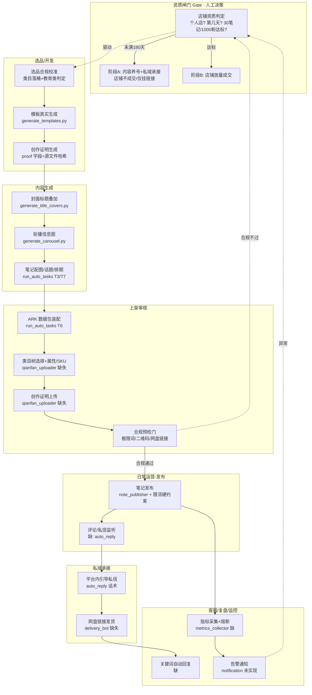

# 小红书虚拟商品 · 端到端自动化全流程设计方案（工程第 3 步）

> 设计对象：`xiaohongshu_automation`（自动化引擎）+ `xiaohongshu_shop`（产品/运营资料）
> 上游依据：`00-diagnosis/diagnosis-report.md`（P-01~P-18 + 缺失环节 + 合规风险）、`01-improvement/improvement-plan.md`（15 任务 P0→P1→P2）
> 设计人：automation-designer-2（OPC 自动化架构设计师）
> 日期：2026-07-16
> 性质：**设计/方案层**，不直接改代码；凡涉及改动均标注「文件·函数」与改动意图。
> 核心约束：**个人店、开店 96 天（未满 180 天入驻门槛）→ 早期以内容养号 + 私域为主、店铺成交后置；资质达标后放量**。平台红线：**虚拟类目三大类（PPT/简历/其他模板、课件教案手抄报、头像壁纸）+ 创作证明 + 即时发货 + 禁极限词 + 禁二维码/微信**。

---

## ① 全流程总览图



**总览解读**：全流程是一条「资质闸门 → 选品开发 → 内容生成 → 上架审核 → 发布 → 私域 → 发货 → 客服/复盘」的单向主链，但被两道**强制闸门**打断：
- **资质闸门（GATE）**：个人店未达 180 天/30 笔记/1000 粉前，链路只走到「发布 + 私域承接」，不进入「店铺成交/发货」；达标后整链贯通。
- **合规预检门（L4）**：上架前必须过极限词/二维码/网盘链接/创作证明校验，否则回退重做，禁止带病上架。

---

## ② 分环节设计

### 2.1 环节一：选品 / 开发（Niche & Product Dev）

**目的**：确定卖什么、生成可交付的真实模板、补齐创作证明，并把类目合规校准前置到开发阶段（而非上架时才发现违规）。

**流程链**：
```
选品清单(products.json 8产品)
  → 类目落桶校准(对照三大虚拟类目)
  → 教育类判定(答辩PPT 三选一)
  → generate_templates.py 生成 docx/pptx/xlsx/md 真实交付物
  → 创作证明生成(proof 字段 + 源文件哈希)
  → 资产对账(run_auto_tasks T1/T2/T4)
```

**自动化程度**：**半自动**（选品决策与类目合规判定需人工确认；模板生成与证明生成可全自动）。

**人工介入点**：
- **触发条件**：新增/下线产品；平台类目政策变动；答辩 PPT 类目三选一（下架/换类目/补资质）决策时。
- **动作**：店主确认 `products.json` 的 `category` 是否落入三大类；确认教育类处置方案。

**与现有代码的映射**：
- ✅ `generate_templates.py`：真实生成 8 套交付物（docx/pptx/xlsx/md）。**缺口**：依赖 `Microsoft YaHei` + `C:/Windows/Fonts/simhei.ttf` 硬编码（P-07/P-08），缺 `resolve_font()` 容错。
- ✅ `run_auto_tasks.py` T1/T2/T4：目录清理、template_file 回填、资产对账。
- ❌ **缺失**：类目落桶校验模块、`products.json` 无 `proof` 字段（诊断 3.2 建议新增）。

**关键节点**：
- **类目落桶**：AI提示词包 / Notion模板库 / 小红书笔记模板包 当前类目不在三大类内 → 须落到「其他模板」桶；毕业答辩 PPT 属教育类（个人店出局）→ 按改进方案 3.3 三选一，默认下架（方案 A）或剥离教育属性（方案 B）。
- **创作证明**：为每个产品生成 `00_上架产品/创作证明/<商品>.md`（原创声明 + 源文件时间戳/哈希），并在 `products.json` 增加 `proof` 字段，`run_auto_tasks` T6 带到 ARK 包。

---

### 2.2 环节二：内容生成（Content Generation：封面 / 轮播 / 笔记装配）

**目的**：把产品素材转化为可发布的笔记内容（封面图、轮播信息图、配图映射、话题、排期）。

**流程链**：
```
products.json / notes.json
  → generate_title_covers.py (封面≤9字标题叠加)
  → generate_carousel.py (每产品3张: 痛点/卖点/引导)
  → run_auto_tasks T3 (笔记配图+话题映射)
  → run_auto_tasks T7 (商品/种草排期 → schedule.json)
  → fix_notes_schedule.py (兜底重排)
```

**自动化程度**：**全自动**（脚本化、可定时跑）。

**人工介入点**：
- **触发条件**：轮播「引导图」含站外引流话术/二维码风险时（诊断 5.2：guide 图需复核禁二维码/微信号）；封面图清晰度不满意。
- **动作**：复核 `data/images/carousel/` 下 guide 图，确认无二维码/微信号；必要时人工替换。

**与现有代码的映射**：
- ✅ `generate_title_covers.py` / `generate_carousel.py`：PIL 生成封面与轮播图（P-07 硬编码字体路径需修）。
- ✅ `run_auto_tasks.py` T3/T7：笔记配图与排期。
- ⚠️ **重复逻辑**：T3/T7 与 `fix_notes_schedule.py` 各实现一份配图/排期，兜底 key 不同（P-14）→ 抽 `note_planning.py` 公共模块。

**关键节点**：
- **字体兼容性**：`generate_*.py` 写死 Windows 字体，跨机/非 Windows 失效 → 抽 `resolve_font()`，依次尝试配置字体 → 系统常见字体 → PIL 默认，缺失降级不崩。
- **站外导流合规**：轮播 guide 图文案「私信【提示词】领取」「评论区扣1拉群」属站外引流 → 改为平台内允许话术（「收藏本笔记」「进主页看商品」），降违规风险。

---

### 2.3 环节三：上架审核（Listing & Compliance Review）

**目的**：把产品装配成 ARK 上架数据包、选择类目树、上传创作证明，并在提交前过合规预检门。这是当前**最薄弱、断点最多**的环节。

**流程链**：
```
products.json + 真实模板文件
  → run_auto_tasks T6 → ark_listing_payload.json
  → 合规预检门(极限词/二维码/网盘链接/创作证明)
  → qianfan_uploader 填表(标题/价格/库存/描述/图)
  → 类目树选择(缺失)
  → 属性/SKU/创作证明上传(缺失)
  → 提交 → 平台审核
```

**自动化程度**：**半自动**（填表可脚本，但类目树/属性/SKU/创作证明上传需人工或待开发；合规预检门自动拦截）。

**人工介入点**：
- **触发条件**：合规预检门命中极限词/缺创作证明/网盘链接占位；ARK 后台类目树与本地不一致；提交后平台驳回需人工复核资质。
- **动作**：修正文案/补证明/回填网盘链接；人工在 ARK 后台选择类目与上传资质（当前代码未实现这几步）。

**与现有代码的映射**：
- ✅ `run_auto_tasks.py` T6：装配 `ark_listing_payload.json`。**缺口**：与 `products.json` 数量词不一致（P-06，「50+套」 vs 「30+套」），须以 products.json 为权威源重跑。
- ⚠️ `qianfan_uploader.py`：仅脆弱选择器填表，**未实现**类目树选择、属性/SKU、创作证明上传、收款绑定校验（诊断缺失环节）；cookie 读取崩溃（P-01）；选择器脆弱（P-15）；异常静默（P-16）。
- ❌ **缺失**：合规预检模块（极限词/二维码扫描/网盘链接校验）、创作证明上传逻辑。

**关键节点**：
- **合规预检门（设计新增 `compliance_gate.py`）**：上架前自动扫描 ①标题/描述极限词（免费送/全网最全/第一/永久→软化「持续更新」）②图片含二维码/微信号（用 OCR 或人工标注清单）③`netdisk_link` 是否真实回填 ④`proof` 字段是否齐全。任一不过 → 阻断上架并告警。
- **ARK 包对齐**：以 `products.json` 为单一数据源，T6 重跑生成，加 `verify_materials.py` 一致性断言（标题/价格/数量词逐一比对）。

---

### 2.4 环节四：日常运营 — 内容发布（Publishing）

**目的**：按排期把笔记发布到小红书主站，控频防限流，并保证发布可靠性（不假成功、不传空图）。

**流程链**：
```
schedule.json (待发布队列)
  → cookie 有效性前置检查(validate_cookies 改造)
  → note_publisher.publish_note (填标题/正文/图/标签)
  → 发布成功提示 mandatory 检测
  → 限流硬约束(滑动窗口≤max_per_hour)
  → 失败重试/退避/告警
```

**自动化程度**：**半自动**（排期与发布可全自动；发布前需有效登录态；失败需人工/告警介入）。

**人工介入点**：
- **触发条件**：cookie 过期/临近过期（P-10/P-11）→ 需人工扫码重登；发布按钮缺失/选择器失效（P-15）→ 需人工验证选择器；触发人机验证（P-13）→ 需人工过验证码。
- **动作**：重登补 cookie；更新 `config/selectors.json`；浏览器手动过验证码后导 cookie。

**与现有代码的映射**：
- ✅ `note_publisher.py`：Selenium 发布。
- 🔴 **需修**：P-01（load_cookies 格式）+ P-03（假成功：找不到发布按钮仍 `success_count+=1`）+ P-04（JS 空文件兜底）+ P-16（静默吞异常）+ P-17（限流未与 max_per_hour 联动）。
- ✅ `xhs_auto_main.py`：编排 `publish_notes`；**缺口**：失败仅计数跳过、无真正重试/熔断（P-09）。
- ✅ `xhs_auto_mcp.py`：MCP `publish_note`/`batch_publish`；**需修** P-05（mgr.login 不存在）。

**关键节点**：
- **Cookie 登录态维护（设计重点）**：统一磁盘格式为 `{"cookies":[...], "timestamp":"...", "url":"..."}`（T-P0-01）；读取端兼容裸列表旧文件；`validate_cookies` 解析 `expires` 返回 EXPIRED/NEAR_EXPIRY(<24h)/VALID（T-P1-04）；临近过期 → 企微/飞书告警 + 暂停自动发布；写入后 `os.chmod(0o600)`（T-P2-04）。新增 `cookie_utils.py` 统一读写，消除「自检 VALID 但发布崩溃」。
- **可靠性**：发布后必须检测到「发布成功/已发布」才计成功；按钮缺失→截图+判失败（P-03）；图片控件缺失→判失败不发空文件（P-04）。
- **限流硬约束**：`publish_batch` 改为 `min_gap = 3600/max_per_hour` 且对整批做任意 60 分钟窗口滑动计数 ≤ `max_per_hour`（T-P2-05）。

---

### 2.5 环节五：私域承接（Private Domain / 平台内引导）

**目的**：把笔记曝光 → 收藏/评论/私信的流量，用平台内允许的引导话术承接，沉淀到店铺成交或粉丝关系。**注意**：平台禁二维码/微信号、禁站外导流，故「私域」在此定义为**平台内 DM 承接 + 关注/收藏引导**，不得出现微信/二维码/外链。

**流程链**：
```
笔记曝光 → 用户评论/私信
  → auto_reply 监听(缺)
  → 关键词命中(模板/简历/PPT/提示词/资料)
  → 平台内引导话术(引导私信/进主页商品)
  → 私信发网盘链接(衔接发货)
```

**自动化程度**：**半自动**（监听与关键词回复可脚本；话术需人工拟定并合规审核）。

**人工介入点**：
- **触发条件**：命中未覆盖的关键词；出现客诉/纠纷；话术需随合规政策调整。
- **动作**：补充关键词词典；复核话术无站外导流/无违规承诺。

**与现有代码的映射**：
- ❌ **完全缺失**：`auto_reply` 监听与回复模块（诊断缺失环节「客服/自动回复」）；运营策略有描述但无实现。

**关键节点**：
- **合规话术**：统一话术「已发你网盘链接，下单后自动发货～」改为平台内允许表述，去掉微信/二维码；引导用「主页商品 / 收藏笔记」而非「加微信 / 扫码」。
- **资质闸门联动**：未满 180 天阶段，私域承接只做「引导关注 + 内容沉淀」，不主动诱导店铺成交（规避个人店未达标风险）。

---

### 2.6 环节六：发货（Instant Delivery / 网盘回填）

**目的**：买家付款后，系统即时把百度网盘链接发给买家，满足「虚拟商品即时发货」硬性要求。这是诊断判定的**最严重业务断点**。

**流程链**：
```
ARK 已付款订单(轮询API/回调)
  → 按 product 查 products.json.netdisk_link
  → delivery_bot 经 ARK 私信/自动回复发链接
  → 标记 delivered 去重
  → 失败重试 + 告警
  → 网盘链接失效监控(每日探测200)
```

**自动化程度**：**全自动**（打通后）；**当前为 0% 实现**——`netdisk_link` 全量占位、网盘未连接、无发货代码。

**人工介入点**：
- **触发条件**：网盘链接失效/变更；连接器未授权；发货失败重试耗尽。
- **动作**：重连 baidu-netdisk 授权；更新分享链接并回写 `products.json` + 重跑 T6。

**与现有代码的映射**：
- ✅ 前置脚本已就绪：`00_上架产品/网盘对接操作清单.md`（4 步：核验→上传→生成分享链接回填→校验），依赖 `baidu-netdisk` 连接器授权。
- ❌ **缺失**：`delivery_bot.py`（订单监听 + 链接回填 + 去重 + 重试）；`products.json.netdisk_link` 仍为 `【待填写】`。

**关键节点**：
- **即时发货落地（设计新增 `delivery_bot.py`）**：先由 `baidu-netdisk` 连接器为每个产品生成**永久有效**分享链接回填 `netdisk_link`（替换占位）；再监听 ARK 已付款订单，按商品取链接私信发送，记 `delivered` 去重。
- **文案对齐（合规）**：T-P2-01 跑通前，**禁止** description 写「下单后秒到/自动发货」，改为「付款后系统发送网盘链接」；跑通后恢复「秒到」承诺。
- **风控**：每日探测链接 200，失效自动回写并重生成 ARK 包。

---

### 2.7 环节七：客服 / 复盘 / 监控（Ops）

**目的**：关键词自动回复、指标采集、异常熔断与告警，形成运营闭环反馈。

**流程链**：
```
metrics_collector 拉取 ARK 曝光/互动/成交
  → 写入 logs/metrics.json
  → 周复盘(淘汰零成交/加推高互动)
  → 失败率/限流异常 → notification webhook 告警
  → 熔断(暂停自动任务)
```

**自动化程度**：**半自动**（采集与告警可全自动；复盘决策需人工）。

**人工介入点**：
- **触发条件**：失败率突增、被限流/封号预警；周复盘优劣取舍。
- **动作**：人工介入排查；调整内容策略与淘汰清单。

**与现有代码的映射**：
- ❌ **缺失**：`metrics_collector.py`（指标采集）；`notification` 在 `config.json` 为 `enabled:false` 且无实现（T-P1-03 需实现 `_alert`）。
- ✅ `xhs_auto_main.status_report()`：仅统计成功/失败计数，无平台指标。

**关键节点**：
- **告警与熔断**：实现 `notification.webhook_url` POST（企微/飞书/Server酱）；失败率超阈值 → 暂停自动发布/上架，避免批量翻车。
- **复盘闭环**：每周指标快照驱动「选品/内容」环节迭代（回到 2.1/2.2）。

---

## ③ 自动化程度矩阵表

| 环节 | 子动作 | 自动化程度 | 主要支撑代码 | 关键缺口 |
|---|---|---|---|---|
| 选品/开发 | 类目落桶校准 | 人工为主 | 无（需新增） | 缺合规校验模块 |
| 选品/开发 | 模板真实生成 | 全自动 | `generate_templates.py` | P-07/P-08 字体硬编码 |
| 选品/开发 | 创作证明生成 | 全自动 | 无（需 `proof` 字段） | 缺 proof 机制 |
| 内容生成 | 封面/轮播图 | 全自动 | `generate_title_covers/carousel.py` | P-07 字体；guide 图引流合规 |
| 内容生成 | 笔记配图/排期 | 全自动 | `run_auto_tasks` T3/T7 | P-14 重复逻辑 |
| 上架审核 | ARK 数据包装配 | 全自动 | `run_auto_tasks` T6 | P-06 数量词不一致 |
| 上架审核 | 填表提交 | 半自动 | `qianfan_uploader.py` | P-01/P-15/P-16；缺类目树/属性/证明上传 |
| 上架审核 | 合规预检门 | 半自动(自动拦+人工改) | 无（需 `compliance_gate.py`） | 完全缺失 |
| 发布 | 发布执行 | 半自动 | `note_publisher.py` | P-01/P-03/P-04/P-17 |
| 发布 | 登录态维护 | 半自动 | `login_manager` + 各登录脚本 | P-01/P-10/P-11/P-12 |
| 私域承接 | 评论/私信监听回复 | 半自动 | 无（需 `auto_reply`） | 完全缺失 |
| 发货 | 网盘链接回填 | 全自动(打通后) | `网盘对接操作清单` + 连接器 | 连接器未授权、链接全占位 |
| 发货 | 订单监听自动发链接 | 全自动(打通后) | 无（需 `delivery_bot.py`） | 完全缺失 |
| 客服/复盘 | 指标采集 | 全自动 | 无（需 `metrics_collector.py`） | 完全缺失 |
| 客服/复盘 | 告警/熔断 | 半自动 | `config.notification` | 未实现 |

**自动化程度占比（按动作数估算）**：全自动 ≈ 45%、半自动 ≈ 45%、人工为主 ≈ 10%。**断点集中在「上架审核后半段（类目/证明/发货）」「私域/客服/监控」**——恰是一人公司最该自动化处。

---

## ④ 人工介入点清单

| # | 介入点 | 触发条件 | 介入动作 | 关联环节 |
|---|---|---|---|---|
| H-1 | 选品类目合规决策 | 新增/下线产品、政策变动、答辩PPT三选一 | 确认类目落桶、教育类处置 | 选品 |
| H-2 | 创作证明提供 | 上架前 proof 字段缺失 | 生成/补充原创证明与授权书 | 选品/上架 |
| H-3 | 网盘链接授权与回填 | `baidu-netdisk` 未连接、链接占位 | 授权连接器、回填 `netdisk_link` | 发货 |
| H-4 | 封面/轮播图合规复核 | guide 图疑似含二维码/微信号/外链 | 替换/重生成图片 | 内容 |
| H-5 | Cookie 重登 | 过期/临近过期(<24h)、自检失败 | 浏览器扫码重登、导 cookie | 发布/登录 |
| H-6 | 选择器适配 | XHS/ARK UI 改版、发布按钮缺失 | 更新 `config/selectors.json` | 发布/上架 |
| H-7 | 人机验证 | 触发滑块/点选验证码 | 浏览器手动过验证后导 cookie | 登录 |
| H-8 | 平台驳回/资质复核 | ARK 审核驳回 | 人工补资质/改类目重提 | 上架 |
| H-9 | 话术与合规审查 | 政策变动、客诉、未覆盖关键词 | 拟/审平台内引导话术 | 私域/客服 |
| H-10 | 周复盘决策 | 每周指标快照 | 淘汰零成交、加推高互动 | 复盘 |
| H-11 | 资质闸门切换 | 满 180 天/30 笔记/1000 粉达标 | 由「阶段A养号」切「阶段B放量」 | 全局 Gate |

**设计原则**：每个介入点都应能被**自动检测并主动告警**（T-P1-03 `_alert`），而非靠人盯日志；告警渠道复用 `config.notification.webhook_url`。

---

## ⑤ 与现有代码的缺口映射（对应诊断 P-0x）

| 设计环节 | 缺口描述 | 诊断编号 | 现有代码位置 | 建议改动（文件·函数） |
|---|---|---|---|---|
| 登录态维护 | cookie 格式裸列表 vs 包裹不一致 | P-01 / P-18（根因） | `login_qr_helper.py`/`ark_login.py` 写裸列表；`note_publisher.load_cookies`/`qianfan_uploader.load_cookies`/`check_xhs_cookies.py` 读包裹 | 新增 `cookie_utils.py`（`normalize_cookies`/`save_cookies`）；三端统一调用；读取端兼容裸列表 |
| 环境可复现 | requirements 缺 5 依赖 | P-02 | `requirements.txt` | 补 playwright/Pillow/python-docx/python-pptx/openpyxl |
| 发布可靠性 | 找不到发布按钮仍计成功 | P-03 | `note_publisher.py:504-507` `publish_note` | 改为判失败+截图+`return False` |
| 发布可靠性 | JS 兜底发空文件 | P-04 | `note_publisher.py:249-274` `upload_images` | 控件缺失→`return False` |
| MCP 登录 | 调不存在的 `mgr.login()` | P-05 | `xhs_auto_mcp.py:66` `login` | 改为 `login_xiaohongshu`/`login_qianfan` 分发 |
| 数据一致性 | ARK 包「50+套」vs 产品「30+套」 | P-06 | `ark_listing_payload.json`/`run_auto_tasks` T6 | 以 products.json 为权威源重跑 T6 + `verify_materials.py` 断言 |
| 可移植性 | 硬编码绝对路径/字体 | P-07 / P-08 | `run_auto_tasks`/`fix_*.py`/`build_ima_bundle.py`/`generate_*.py` | `Path(__file__).parent` + config；`resolve_font()` 容错 |
| 重试/熔断 | 仅 sleep 无重试/退避/熔断 | P-09 | `xhs_auto_main.publish_notes/upload_products` | 抽 `_with_retry`（指数退避）+ 接入 `notification` |
| Cookie 校验 | 只查文件存在不解析过期 | P-10 / P-11 | `login_manager.validate_cookies` | 解析 `expires` 返回 EXPIRED/NEAR_EXPIRY/VALID；临近过期告警+暂停 |
| 凭证安全 | 密码走命令行参数明文 | P-12 | `ark_login.py:45-50` | 改 `os.getenv("ARK_PASSWORD") or getpass()`；`os.chmod(0o600)` |
| 人机验证 | 验证码无助 | P-13 | `login_qr_helper.py`/`ark_login.py` | 检测验证码元素→截图+告警+退出 |
| 重复逻辑 | T3/T7 两份实现 | P-14 | `run_auto_tasks.py` vs `fix_notes_schedule.py` | 抽 `note_planning.py` 公共模块 |
| 选择器脆弱 | 猜测式选择器 | P-15 | `note_publisher.py`/`qianfan_uploader.py` | 抽 `config/selectors.json`，UI 改版只改一处 |
| 静默异常 | 裸 except 吞错误 | P-16 | `note_publisher.wait_and_click`/`add_tags` 等 | 改为 `except Exception as e: log+截图+return False` |
| 限流联动 | 间隔随机不联动上限 | P-17 | `note_publisher.publish_batch` | `min_gap=3600/max_per_hour` + 滑动窗口计数 |
| 上架审核 | 类目树/属性/SKU/证明上传 | 缺失环节 | `qianfan_uploader.py` | 新增类目选择、属性/SKU、创作证明上传步骤 |
| 合规预检 | 极限词/二维码/网盘链接校验 | 缺失+合规 | 无 | 新增 `compliance_gate.py` |
| 自动发货 | 订单监听+网盘回填 | 缺失（最严重） | 无 | 新增 `delivery_bot.py` + 回填 `netdisk_link` |
| 自动回复 | 评论/私信监听 | 缺失 | 无 | 新增 `auto_reply.py` |
| 监控复盘 | 指标采集+熔断告警 | 缺失 | `config.notification` 未实现 | 新增 `metrics_collector.py` + `_alert` 实现 |

---

## ⑥ 实施优先级建议（对齐改进方案 P0→P2）

> 设计层给出落地节奏；具体改动见 `01-improvement/improvement-plan.md`（T-P0-01~T-P2-05）。本方案以「资质闸门 + 合规预检门」为最高优先，确保**带病不上架、未达标不成交**。

### 阶段一 · 止血（P0）— 主链路能跑通、不违规
1. **T-P0-01 统一 Cookie 格式**（P-01/P-18）：所有读写自检端统一为 `{"cookies":[...],"timestamp","url"}`，新增 `cookie_utils.py`。→ 发布/上架不再 `KeyError`。
2. **T-P0-02 补 requirements**（P-02）：补 5 依赖，干净 venv 可装可跑。
3. **T-P0-03 修假成功 + T-P0-04 修 MCP login**（P-03/P-05）：发布可靠性 + MCP 可用。
4. **T-P0-05 ARK 包对齐**（P-06）：以 products.json 重跑 T6，加一致性断言。
5. **合规闸门（设计新增 `compliance_gate.py` + 资质闸门 GATE）**：教育类三选一（默认下架答辩PPT）、类目落桶、未达标不进店铺成交。→ 上架前硬拦截。

### 阶段二 · 补闭环（P1）— 首单可安全上架
6. **T-P1-01 空文件修复**（P-04）、**T-P1-02 去硬编码/字体容错**（P-07/P-08）。
7. **T-P1-03 重试/退避/熔断 + 告警**（P-09）：实现 `notification._alert`，与后续监控共用。
8. **T-P1-04 Cookie 过期拦截 + 临近预警**（P-10/P-11）：发布/上架前强制校验。
9. **T-P1-05 选择器集中 + 停止静默异常**（P-15/P-16）：`config/selectors.json`。
10. **合规落地**：3 个风险类目归桶、8 商品补 `proof` 创作证明、`netdisk_link` 回填（先接 `baidu-netdisk`）。

### 阶段三 · 健壮（P2）— 长期自动运营
11. **T-P2-01 自动发货 + 自动回复**（最大断点）：`delivery_bot.py` + `auto_reply.py`，打通即时发货与私域承接。
12. **T-P2-02 监控复盘**：`metrics_collector.py` + 失败率熔断告警。
13. **T-P2-03 逻辑统一**（P-14）、**T-P2-04 凭证安全**（P-12）、**T-P2-05 限流硬约束**（P-17）。

### 关键路径依赖（设计视角的硬约束）
- **Cookie 统一（P0-01）是所有发布/上架动作的地基**，必须先做。
- **合规闸门 + 资质闸门**是上架/成交的总开关，须与 P0 同期定案（店主确认账号资质）。
- **自动发货（P2-01）依赖网盘回填 + 创作证明 + 类目归桶**——合规整改是发货前提，非并行项。
- **资质未达标（<180 天）期间**：自动化只跑「选品/内容/发布/私域引导」，不触发「店铺成交/发货」；达标后由 H-11 切换放量。

---

## 附：设计层关键决策摘要（供主理人拍板）

1. **两道闸门**：资质闸门（决定店铺是否成交）+ 合规预检门（决定能否上架），均为强制、自动拦截 + 人工兜底。
2. **新增模块清单**：`cookie_utils.py`、`compliance_gate.py`、`delivery_bot.py`、`auto_reply.py`、`metrics_collector.py`、`note_planning.py`（抽公共）、`config/selectors.json`。
3. **最危险断点**：自动发货（0% 实现）+ 类目/创作证明未落地 + cookie 格式崩溃；按 P0→P2 顺序必须先止血再补闭环。
4. **合规红线不可绕**：个人店未满 180 天以养号+私域为主；答辩 PPT 默认下架；AI提示词/Notion/笔记模板须归「其他模板」桶；即时发货未通前禁止写「秒到」。

*（本文档为设计/方案层，基于 2026-07-16 对两目录源码与文档的静态审阅，未修改任何源文件。）*
