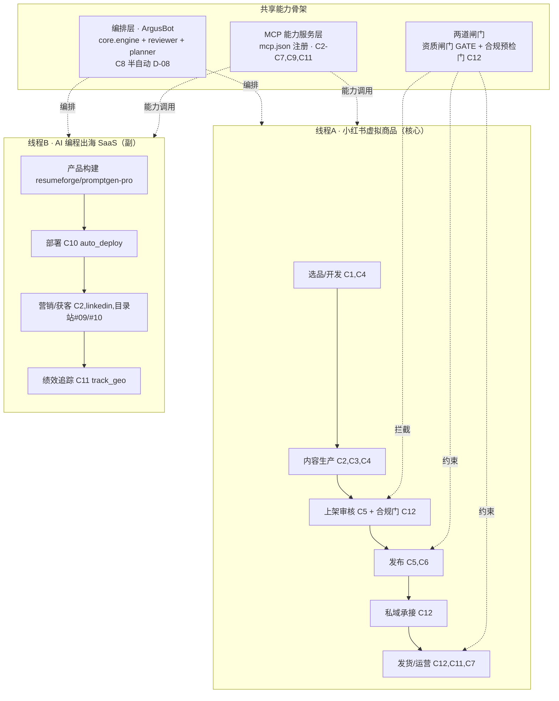

# 工程第 4 步 · 端到端工作流（融合前 10 GitHub 仓库核心能力 + AI 编程出海工作流）· 实施方案规划（草稿）

> 规划人：general-purpose-5（OPC 工程规划 agent）
> 日期：2026-07-17
> 上游依据：`eng-automation/automation-design.md`（第 3 步四段设计）、`state/decisions.json`（D-01/04/05/08/10/12/13）、`references/github-repos/INDEX.md`、`OPC出海文档汇总/06_GitHub资源地图/`
> 性质：**规划/方案层草稿**，不写大量实现代码、不合并/删除任何源文件。凡涉及改动仅标注「文件·函数 + 意图」。

---

## 0. 执行摘要与关键修正（必读）

**结论先行**：所谓「前 10 GitHub 仓库」经全树核查，全部为**研究资料（awesome-list 链接集 + 1 个未克隆的 SaaS 模板）**，本地并无可 import 的运行时代码。因此「融合核心能力」须**重新解读**为：

> 以前 10 仓库作为**能力目录 / 参考架构**（找方向、找痛点、找分发渠道），真正要「融合」的是**本地已可运行的代码资产**——28 个 `*_mcp` 能力服务、ArgusBot 编排框架、`12_Micro_SaaS出海` 产品/部署管线、内容生成引擎（gpt_academic / SciTeX / AutoFigure 等），它们才是端到端工作流的能力供给方。

这一修正直接决定了步骤 4 的落地形态：**不是「克隆 10 个仓库拼装」，而是「以能力中台（MCP 服务层）+ ArgusBot 编排层为骨架，接入并贯通小红书虚拟商品主链路 + AI 编程出海副链路」**。

---

## 1. 「前 10 GitHub 仓库」定位清单

> 真实状态：9/10 已 shallow clone 至 `E:/AgentCPM/07_一人公司出海项目/references/github-repos/`，内容为 README 链接集；#07 open-saas 截至 2026-07-16 仍「重试中」，当前目录不存在。

| # | 仓库 | 本地路径 | 类型 | 内容性质 | 技术栈 | 可复用「能力」（参考级，非代码） | 不确定性 |
|---|---|---|---|---|---|---|---|
| 01 | awesome-one-person-company | `references/github-repos/01-…/` | 中文案例库 | README 链接集（MRR/渠道/踩坑） | Markdown | 一人公司案例/痛点基线 | 低：已克隆 |
| 02 | chinese-independent-developer | `references/github-repos/02-…/` | 国内开发者库 | README + pages | Markdown | 产品形态/定价参照 | 低 |
| 03 | awesome-indie | `references/github-repos/03-…/` | 全球资源库 | 链接集 | Markdown | SEO/邮件营销/支付/自动化灵感 | 低 |
| 04 | awesome-indiehackers | `references/github-repos/04-…/` | 人物故事库 | 链接集 | Markdown | 收入复盘/避坑情绪燃料 | 低 |
| 05 | Best-Micro-SaaS-Tools | `references/github-repos/05-…/` | 方向合集 | 链接集 | Markdown | AI 小工具/自动化方向验证 | 低 |
| 06 | awesome-solo-founder-oss | `references/github-repos/06-…/` | 技术栈合集 | 链接集 | Markdown | 登录/邮件/分析/客服开源方案清单 | 低 |
| 07 | **Open SaaS** | `references/github-repos/07-open-saas/`（**不存在**） | 开源 SaaS 模板 | **未克隆**（仅文档引用；内置 Stripe，需换 Waffo） | React/Wasp/Node | 唯一含真实代码的模板：登录/支付/后台/Landing | **高**：仓库大、克隆未完成；Waffo 替换未验证 |
| 08 | awesome-indie-hackers-tools | `references/github-repos/08-…/` | 工具清单 | 链接集 | Markdown | 建站/分析/反馈/SEO/自动化工具采购单 | 低 |
| 09 | awesome-launch-platforms | `references/github-repos/09-…/` | 发布平台清单 | 链接集 | Markdown | PH/HN/Reddit 首发渠道清单 | 低 |
| 10 | Awesome-SaaS-Directories | `references/github-repos/10-…/` | 目录站清单 | 链接集 | Markdown | SEO 目录站提交清单（Tier 分层） | 低 |

**核实方法**：`references/github-repos/INDEX.md` 明确写「这些仓库是『研究资料』不是『照搬代码』」；目录实测仅含 `README*.md`+`assets`（如 01 只有 README+assets，无 `.py/.ts`）；`07-open-saas` 目录经 `Glob` 确认不存在。

**对步骤 4 的影响**：这 10 个仓库的「核心能力」是**概念性/索引性**的，只能作为设计参考与内容素材（如用 #09/#10 指导小红书/出海获客渠道清单、用 #05 校验需求）。**不能**作为代码模块被端到端工作流直接调用。真正的能力融合对象见第 2 节。

---

## 2. 可真正融合的本地代码资产（能力供给方）

全树扫描后，以下目录是**有可运行代码**、可成为端到端工作流「能力节点」的真实资产。

### 2.1 编排 / 代理框架（步骤 5 的执行引擎）
| 资产 | 路径 | 技术栈 | 核心能力 | 衔接点 |
|---|---|---|---|---|
| **ArgusBot** | `E:/AgentCPM/ArgusBot/` | Node.js + Python（`package.json`+`pyproject.toml`） | 主代理循环引擎（`core.engine`）+ 评审代理（`reviewer`）+ 规划代理（`orchestrator`/`Planner`）+ Dashboard + Telegram/JSONL 总线；`--check` 验收门 + 停止条件（done/blocked/max_rounds） | 步骤 5「ArgusBot 执行包」的基座；本步骤先预留 `objective`/事件流接口，半自动编排（D-08） |

### 2.2 MCP 能力服务层（28 个 `*_mcp`，分布在两处）
- `E:/AgentCPM/04_开发脚本_工具/`（`browser_automation_mcp`、`desktop_automation_mcp`、`computer_use_agent_mcp`、`media_enhancement_mcp`、`sd_mcp`、`realesrgan_mcp`、`video_enhancement_mcp`、`chart_router`、`markitdown_mcp`、`ppt_services`、`mem0_mcp`、`vector_memory`、`context-memory-manager`、`langgraph_mcp`、`crewai_mcp`、`autogen_mcp`、`sequential_thinking_mcp`、`agentic_metric_mcp`、`context7_mcp`、`free_public_apis_mcp`、`mlflow_mcp`、`citespace_automation_mcp`、`paper_orchestra_mcp`、`patent_mcp`、`grant_proposal_mcp`、`hermes_skill_engine`、`workbuddy_memory_optimizer`、`multica_agent_platform` 等）
- `E:/AgentCPM/06_MCP服务器/`（`agent-harness-mcp`、`autoresearch-mcp`、`autoskill-mcp`、`awesome-design-md-mcp`、`claude-mem-mcp`、`cnki-skills-mcp`、`code-sandbox-mcp`、`cognee-mcp`、`deeptutor-mcp`、`evoscientist-mcp`、`karpathy_wiki_mcp`、`progressive-skill-loader-mcp`、`rtk-mcp`、`scene-memory-mcp`、`zotero-mcp` 等）

> 统一接入点：根目录 `E:/AgentCPM/mcp.json`（MCP 服务器注册表），工作流通过 `mcp.json` 调用，避免逐仓库硬编码。

### 2.3 AI 编程出海产品线 + 部署/营销管线（副链路能力源）
| 资产 | 路径 | 技术栈 | 核心能力 | 与利基关联 |
|---|---|---|---|---|
| **12_Micro_SaaS出海**（~26 个产品） | `E:/AgentCPM/07_一人公司出海项目/12_Micro_SaaS出海/` | Next.js / Vercel | 已构建可部署的 AI SaaS 产品 | `resumeforge`（简历）、`promptgen-pro`（提示词）与 D-07 主利基（简历/PPT）同源，可反哺内容生产素材 |
| **auto_deploy_all.py** | `07_一人公司出海项目/` | Python + Vercel CLI | 批量 Vercel 部署 + 结果报告 | 部署能力 |
| **batch_deploy.py / batch_deploy.sh** | 同上 | Python | 分批部署 + JSON 报告 | 部署能力 |
| **generate_marketing_content.py** | 同上 | Python | 批量生成英文推广文案（含产品 title/tagline/描述/标签） | 内容生成能力（出海） |
| **linkedin_auto_publish.py** | 同上 | Python + LinkedIn API（环境变量） | LinkedIn 自动发布（模板驱动） | 获客/发布能力 |
| **track_geo_performance.py** | 同上 | Python | GEO/SEO 绩效追踪 | 监控能力 |

### 2.4 内容 / 文档生成引擎（独立大仓）
| 资产 | 路径 | 技术栈 | 核心能力 |
|---|---|---|---|
| gpt_academic-master | `E:/AgentCPM/gpt_academic-master/` | Python | 多模型对话/长文生成 |
| SciTeX | `E:/AgentCPM/SciTeX/` | Python | 学术/文档生成（docx 等） |
| AutoFigure | `E:/AgentCPM/AutoFigure/` | Python | 科研图件生成 |
| UltraRAG | `E:/AgentCPM/UltraRAG/` | Python | RAG 管线 |
| AgentCPM-main | `E:/AgentCPM/AgentCPM-main/` | — | 系统文档/中台参考 |

### 2.5 现有小红书自动化引擎（主链路，须先止血）
| 资产 | 路径 | 技术栈 | 说明 |
|---|---|---|---|
| **xiaohongshu_automation** | `E:/AgentCPM/04_开发脚本_工具/xiaohongshu_automation/` | Python（Selenium/PIL）· ~20 个 `.py` | 主链路引擎：`xhs_auto_main.py`（编排）、`note_publisher.py`（发布）、`qianfan_uploader.py`（上架）、`generate_templates.py`/`generate_carousel.py`/`generate_title_covers.py`（生产）、`run_auto_tasks.py`（装配/排期）、`login_manager.py`/`ark_login.py`/`login_qr_helper.py`（登录态）、`xhs_auto_mcp.py`（MCP 封装） |
| xiaohongshu_shop | `E:/AgentCPM/04_开发脚本_工具/xiaohongshu_shop/` | 资料 | `00_上架产品/`、`01_小红书笔记/`、`网盘对接操作清单.md` 等产品/运营资料 |

---

## 3. 核心能力提取（去重归并）

把第 1 节（参考级）与第 2 节（运行级）的能力去重归并，得到端到端工作流需要的 **9 类核心能力**，并映射到供给方与所服务的业务环节：

| 能力 ID | 能力 | 主要供给方（本地资产） | 服务环节（四段） | 对应 10 仓库参考 |
|---|---|---|---|---|
| C1 研究/灵感 | 案例/痛点/渠道检索 | 前 10 仓库（README 链接集，人工读） | 选品 | #01/#02/#03/#05 |
| C2 内容生成（文） | 推广文案/笔记正文/英文 GEO 文 | `generate_marketing_content.py`、gpt_academic、`linkedin_auto_publish.py` | 生产/获客 | #08/#09 |
| C3 内容生成（图/视频） | 封面/轮播/配图/媒体增强 | `media_enhancement_mcp`、`sd_mcp`、`realesrgan_mcp`、`video_enhancement_mcp`、`chart_router`、`generate_title_covers.py`/`generate_carousel.py` | 生产 | — |
| C4 模板渲染 | docx/pptx/xlsx 真实交付物 | `generate_templates.py`、SciTeX、`ppt_services`、markitdown_mcp | 选品/生产 | — |
| C5 浏览器自动化 | 小红书/网盘 填表、发布、上传 | `browser_automation_mcp`、`note_publisher.py`、`qianfan_uploader.py` | 上架/发布 | — |
| C6 桌面自动化 | 本地客户端/扫码/验证码兜底 | `desktop_automation_mcp`、`computer_use_agent_mcp`、`login_qr_helper.py` | 登录/发布 | — |
| C7 数据看板/可视化 | 指标图、GEO 绩效、运营大屏 | `chart_router`、`charts_svg`、ArgusBot `dashboard.py` | 运营/监控 | — |
| C8 代理编排/调度 | 循环执行/评审/规划/验收门/限流 | **ArgusBot**（`core.engine`/`reviewer`/`orchestrator`）、`langgraph_mcp`/`crewai_mcp`/`autogen_mcp`、`sequential_thinking_mcp` | 全局编排 | #06 |
| C9 记忆/知识 | 产品素材库、话术词典、复盘记忆 | `mem0_mcp`/`vector_memory`/`cognee-mcp`/`scene-memory-mcp`/`claude-mem-mcp`（选其一为权威后端）、`xiaohongshu_shop` 资料 | 全链路 | — |
| C10 部署/CI | Vercel 批量部署 + 报告 | `auto_deploy_all.py`/`batch_deploy.py` | 出海产品发布 | #07 |
| C11 监控/告警 | 失败率熔断、Webhook 告警、GEO 追踪 | `track_geo_performance.py`、待建 `metrics_collector.py`、`notification`（config） | 运营/监控 | — |
| C12 合规校验 | 极限词/二维码/网盘链接/创作证明 | 待建 `compliance_gate.py` + `delivery_bot.py` + `auto_reply.py` | 上架门/发货/私域 | — |

> **去重说明**：记忆类 MCP 多达 6+ 个（mem0/vector/cognee/scene/claude-mem/context-memory），须**指定唯一权威后端**（建议 `mem0_mcp` 或 `vector_memory`），其余仅作备选，避免多源不一致。编排类同理：以 ArgusBot 为主编排，langgraph/crewai/autogen 仅作可选子能力，不并列作主循环。

---

## 4. 端到端工作流架构设计

### 4.1 总体架构（双业务线程 + 共享能力骨架）

**设计要点**
- **线程 A（核心）** 严格对齐 `automation-design.md` 四段（选品→生产→上架→发货/运营），是步骤 4 的主战场；其断点（自动发货 0%、合规门缺失、私域/监控缺失）是融合重点。
- **线程 B（副）** 复用 `12_Micro_SaaS出海` + 部署/营销脚本，与线程 A 共享 C2/C7/C8/C9/C11；其中 `resumeforge`/`promptgen-pro` 与 D-07 主利基同源，可把出海产品物料反哺线程 A 的内容生产。
- **共享骨架** 三层：MCP 能力层（通过 `mcp.json` 统一调用，不侵入引擎代码）、编排层（ArgusBot，步骤 5 正式接入）、闸门层（`automation-design.md` 已设计的两道强制闸门）。

### 4.2 模块划分与依赖关系

| 模块 | 职责 | 依赖 | 来源/衔接点 |
|---|---|---|---|
| `capability-registry`（mcp.json） | 统一注册/发现 MCP 能力 | — | 根 `mcp.json`；新增模块只需登记，不改动引擎 |
| `xhs_engine`（现有） | 主链路执行 | cookie_utils、compliance_gate | `xiaohongshu_automation/` 现有 ~20 文件 |
| `cookie_utils.py`（待建/P0） | 统一 cookie 读写 | — | 修复 P-01/P-18，`automation-design.md §⑤` |
| `compliance_gate.py`（待建/P0） | 上架前极限词/二维码/网盘/证明校验 | products.json | 设计新增，`automation-design.md 2.3` |
| `content_gen_adapter` | 封装 C2/C3 内容生成 | media_enhancement_mcp、generate_*.py | 现有 `generate_*.py` + MCP 服务 |
| `browser_adapter` | 封装 C5 浏览器动作 | browser_automation_mcp、note_publisher | 现有发布/上架脚本 |
| `delivery_bot.py`（待建/P2-01） | 订单监听+网盘回填+去重 | baidu-netdisk 连接器、products.json | 设计新增，最严重断点 |
| `auto_reply.py`（待建/P2） | 评论/私信监听+话术 | mem0/话术词典 | 设计新增 |
| `metrics_collector.py`（待建/P2） | 指标采集+熔断 | notification webhook、chart_router | 设计新增 |
| `argus_orchestrator`（步骤5） | objective→loop→reviewer→planner | 上述全部 | ArgusBot `core.engine` |
| `saas_deploy_pipeline` | 线程 B 部署/营销 | auto_deploy_all、generate_marketing_content | 现有脚本 |

### 4.3 与现有 xiaohongshu_automation 引擎的衔接点（文件级）

> 下列衔接点直接复用 `automation-design.md §⑤` 的 P0 缺口映射，本规划不再重复定位，仅指出现有引擎「暴露的接口」：

- **登录态**：`login_manager.validate_cookies` / `note_publisher.load_cookies` / `qianfan_uploader.load_cookies` → 统一改为调 `cookie_utils.py`（T-P0-01）。
- **发布**：`xhs_auto_main.publish_notes` 调 `note_publisher.publish_note` → 接 `browser_adapter` + 限流硬约束（P-17）。
- **上架**：`run_auto_tasks` T6 产出 `ark_listing_payload.json` → 过 `compliance_gate` → `qianfan_uploader` 填表（需补类目树/属性/SKU/证明，P-15/P-16）。
- **MCP 暴露**：`xhs_auto_mcp.py` 已把 `publish_note`/`batch_publish` 包成 MCP → 直接登记进 `mcp.json`，成为能力骨架节点（修复 P-05 `mgr.login`）。
- **编排预留**：`xhs_auto_main.py` 当前是顺序脚本；步骤 5 由 ArgusBot `core.engine` 以 `objective` 驱动调用这些脚本/工具，引擎本身**不改结构**，只被「包裹编排」。

---

## 5. 实施路线与里程碑

对齐 `decisions.json` D-05（P0→P1→P2）与 D-10（步骤 4 先于步骤 5），并呼应 `automation-design.md` 三阶段验收。

### 阶段 0 · P0 止血（复用 automation-design 阶段一，先做）
**目标**：主链路能跑通、不违规；为后续融合打地基。
- 交付物：
  1. `cookie_utils.py`（统一格式 `{"cookies":[...],"timestamp","url"}`，兼容裸列表）— T-P0-01
  2. 补全 `requirements.txt` 5 依赖 — T-P0-02
  3. 修 `note_publisher.py:504-507` 假成功（P-03）、`xhs_auto_mcp.py:66` MCP login（P-05）— T-P0-03/04
  4. 以 `products.json` 为权威源重跑 T6 + `verify_materials.py` 一致性断言（P-06）— T-P0-05
  5. `compliance_gate.py` 雏形 + 资质闸门逻辑（教育类三选一、类目落桶、未达标不成交）— 合规闸门
- **验收标准（呼应阶段一）**：① cookie 读写不再 `KeyError`；② 干净 venv 可装可跑；③ 发布失败能正确判失败（非假成功）；④ ARK 包数量词与 products.json 一致；⑤ 违规文案/缺证明被自动拦截，未达标不进店铺成交。

### 阶段 1 · 融合（P1 补闭环）
**目标**：把第 2/3 节能力以 MCP 服务层接入主链路，首单可安全上架。
- 交付物：
  1. `capability-registry`：把 `media_enhancement_mcp`/`chart_router`/`browser_automation_mcp`/`markitdown_mcp` 等登记进 `mcp.json`，建 `content_gen_adapter`/`browser_adapter` 薄封装 — 能力融合落地
  2. 修空文件兜底（P-04）、去硬编码/字体容错 `resolve_font()`（P-07/P-08）— T-P1-01/02
  3. 重试/退避/熔断 + `notification._alert` 实现（P-09）— T-P1-03
  4. Cookie 过期拦截 + 临近预警（P-10/P-11）— T-P1-04
  5. `config/selectors.json` 集中 + 停静默异常（P-15/P-16）— T-P1-05
  6. 合规落地：3 风险类目归桶、8 商品补 `proof` 创作证明、`netdisk_link` 回填（接 `baidu-netdisk`）— T-P1-06
- **验收标准（呼应阶段二）**：① 内容图经 MCP 增强生成且 guide 图无二维码/微信号；② 发布前 cookie 过期自动暂停+告警；③ 选择器改版只改一处；④ 上架前合规门全部通过才提交；⑤ 网盘链接真实回填（非占位）。

### 阶段 2 · 健壮（P2 长期自动运营）
**目标**：打通最严重断点，形成运营闭环。
- 交付物：
  1. `delivery_bot.py`（订单监听+网盘回填+去重+失败重试）— T-P2-01（最大断点）
  2. `auto_reply.py`（评论/私信监听+平台内话术）— T-P2-01
  3. `metrics_collector.py` + 失败率熔断告警 + `chart_router` 看板 — T-P2-02
  4. 抽 `note_planning.py` 公共模块（P-14）、凭证安全 `os.chmod(0o600)`（P-12）、限流硬约束（P-17）— T-P2-03/04/05
- **验收标准（呼应阶段三）**：① 买家付款后系统即时发网盘链接、去重无误；② 私信关键词命中自动平台内引导；③ 失败率超阈值自动熔断+Webhook 告警；④ 周复盘指标快照驱动选品/内容迭代。

### 阶段 3 · ArgusBot 执行包（步骤 5，依赖步骤 4 完成；D-10）
**目标**：把上述能力以 ArgusBot `objective` 驱动编排成「执行包」。
- **关键约束（D-08）**：仅做**半自动辅助**——ArgusBot 编排脚本/工具，但**不启用无人值守批量发布**；发布/上架保留人工目检与扫码重登。
- 交付物：`argus_orchestrator` 包装（objective→loop→reviewer→planner）、`saas_deploy_pipeline` 接入、执行包 README/运行手册。
- **验收标准**：① ArgusBot 能以 `--check` 驱动单环节验收；② 发布环节默认人工确认闸；③ 无持续运行时不强行 daemon（D-10 注释：本环境 literal 不可行，逐会话推进）。

---

## 6. 风险与前置依赖

### 6.1 P0 修复项（须先完成，否则融合无意义）
按 `automation-design.md §⑤`：P-01 cookie 格式（根因）、P-02 依赖缺失、P-03 假成功、P-05 MCP login、P-06 ARK 包数量词、P-07/P-08 字体硬编码、P-09 无重试熔断、P-10/P-11 cookie 过期、P-12 凭证明文、P-13 人机验证、P-14 重复逻辑、P-15 选择器脆弱、P-16 静默异常、P-17 限流未联动；缺失模块：`compliance_gate.py`/`delivery_bot.py`/`auto_reply.py`/`metrics_collector.py`/`note_planning.py`。
> 注：本规划仅定位，未修复（按任务边界）。

### 6.2 合规约束（硬红线，不可绕过）
- **D-08 半自动优先**：禁无人值守批量发布；自动化模块作辅助开发，发布/上架保留人工目检。
- **D-01 资质闸门**：个人店 96 天 < 180 天门槛未满足 → 早期只「内容养号+私域」，不进店铺成交；达标（180天+30笔记+1000粉+无违规+证明）后由 H-11 切换放量。
- **平台红线**：虚拟三大类（PPT/简历/其他模板、课件教案、头像壁纸）+ 创作证明 + 即时发货 + 禁极限词 + 禁二维码/微信/外链；答辩 PPT（教育类）默认下架。
- **D-09/D-11 导流**：小红书内禁外链/二维码；一字成文 `?tuid` 走站外；不接单代做（学术代写绝对禁）。

### 6.3 仓库间技术栈冲突
| 冲突 | 说明 | 处置 |
|---|---|---|
| 10 仓库 vs 本地资产 | 10 仓库是 Markdown 链接集，无代码 → 不存在「合并代码」冲突 | 仅作参考，不 import |
| **Python vs Node.js** | `xiaohongshu_automation` + `*_mcp` 是 Python；ArgusBot 是 Node.js（`package.json`+`pyproject.toml` 混合）；`12_Micro_SaaS出海` 是 Next.js | 通过 **MCP 协议 / subprocess** 集成，不直接 import；ArgusBot 以 CLI/子进程调 Python 工具 |
| 多记忆后端 | mem0/vector/cognee/scene/claude-mem 并存 | 指定**唯一权威后端**（建议 mem0 或 vector_memory），其余降为备选 |
| 多编排框架 | ArgusBot/langgraph/crewai/autogen | ArgusBot 作主循环，其余作可选子能力 |
| 字体/绝对路径 | `generate_*.py` 写死 `C:/Windows/Fonts/simhei.ttf`（P-07/P-08） | `resolve_font()` 容错 + `Path(__file__).parent` |
| 跨产品耦合 | `12_Micro_SaaS出海` 各产品独立 Vercel 部署 | 不并入 xhs 引擎，仅共享 C2/C7/C8/C9/C11 能力 |

### 6.4 环境前置
- **无持续运行时**（D-10 注释）：ArgusBot daemon/无人值守 literal 不可行 → 本步骤只做「编排接口预留 + 半自动脚本」，逐会话推进。
- `baidu-netdisk` 连接器须授权，否则 `delivery_bot` 与 `netdisk_link` 回填无法闭环（H-3）。
- 网盘链接须「永久有效」，否则每日探测失效需回写重生成 ARK 包。

---

## 7. 待主理人拍板 / 衔接事项

1. **确认修正口径**：接受「前 10 仓库=研究资料，融合对象=本地代码资产」的重新解读（否则步骤 4 无法落地）。
2. **记忆后端选型**：mem0 / vector_memory / cognee 三选一为权威。
3. **线程 B 优先级**：`resumeforge`/`promptgen-pro` 是否优先反哺线程 A 内容生产（与 D-07 主利基同源）。
4. **步骤 5 触发条件**：步骤 4 阶段 0–2 完成后，且 D-08 半自动姿态维持，再启动 ArgusBot 执行包。
5. **Open SaaS（#07）**：是否补全克隆并完成 Waffo 替换验证（当前未克隆，影响线程 B 的 SaaS 模板复用）。

### 7.x 主理人拍板（2026-07-17，用户指令"所有任务自动执行"）
1. ✅ 采纳修正口径：前 10 仓库=研究资料（README 链接集），融合对象=本地代码资产（28 个 *_mcp / ArgusBot / 12_Micro_SaaS出海 / 内容引擎）。
2. ✅ 记忆权威后端=**mem0_mcp**（通用轻量、有 MCP 封装），其余降为备选。
3. ✅ 线程 A（小红书虚拟商品核心）优先；线程 B（AI 编程出海）作副链，resumeforge/promptgen-pro 反哺 A 内容生产（与 D-07 同源），B 整体主线跑通后接入。
4. ✅ 步骤 5 触发=阶段 0 P0 止血 + 阶段 1 融合 验收通过、且维持 D-08 半自动后启动。
5. ✅ Open SaaS(#07) 暂不补全克隆，以本地 12_Micro_SaaS出海 26 产品为准。
> 决策已写入 decisions.json D-14。阶段 0 P0 止血实现已启动（后台）。

---

*（本文档为规划/方案层草稿，基于 2026-07-17 对 `E:/AgentCPM/` 全树静态核查 + 既有设计/决策文档，未修改、合并或删除任何源文件。）*
